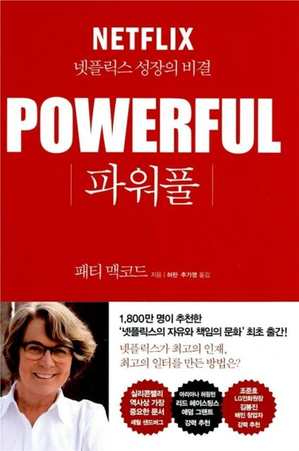

  

 
 

이 책을 읽게된 계기는 **힐링페이퍼**의 지향 하는 문화를 담은 책 이라고 해서 읽게 되었고, 지금 생각해보니 회사 곳곳에 이 책에서 말하는 문구들이 적혀있었다. (예를들면 **극도의** 라는 말들)

내가 이번에 면접 준비를 하면서 서류작성, 자기소개서, 직무면접 열심히 준비했지만 은근히 신경쓰였던 부분은 컬쳐 면접이었다. 회사 대부분이 적어둔 컬쳐핏의 내용은 사실상 **일잘하고**, **의사소통 하는데 있어 상대방을 배려하며 이야기하며** 등.. 거의 좋은 말들이 적혀 있다. 근데 실제로 이건 큰 대분류 일뿐 세부 사항은 정확하게 맞지 않는 경우가 있다. (실제로 컬쳐핏에서 떨어진 곳도 있다.)  
다행히 **힐링페이퍼**에서는 내가 지향하고 있는 업무하는 스타일과 성향이 컬쳐핏이 드러 맞았던 것 같다. 그리고 책을 읽어보니 확실히 비슷한 점, 내가 전혀 실천하지 못하고 있었던 점 그리고 보완되어야 할 점 들을 찾을 수 있었다. 이러한 문화가 모든 회사에 적용될 수 없고 이것이 바로 회사에서 원하는 컬쳐핏 이라고 생각을 하고 있다. 책을 통해서 마인드셋이 잘 될 수 있었던 것 같다.

관심있고, 임팩트가 있었던 문구들을 몇개 기록해 둬야겠다.

1. 가장 강력한 동기는 **함께 일할 좋은 팀원들이 있다**는 데서 나온다. **멋진 일을 하면서 서로에게 도전이 되고 서로를 믿을 수 있는 사람들 말**이다.

2. 지속적인 실험을 통해 당신이 최대한 군더더기 없이 운영할 수 있는 방안을 찾아라. **제품과 서비스를 끊임없이 개선하는 것과 마찬가지로 조직문화도 꾸준히 다듬어야 한다.**

3. 모든 직원들은 **자신에게 주어진 일과 팀의 임무를 이해하고 싶어 한다.** 그뿐 아니라 사업이 어떻게 운영되고 있는지에 대한 큰 그림과 회사가 직면한 도전과제, 경쟁적인 환경에 대해 이해하길 원한다.

4. 가장 중요한 직원 교육은 **사업이 작동되는 방식을 진짜로 이해하는 것이다**.

5. 직원들은 사업에 대해서도, 자신들의 성과에 대해서도 진신을 듣고 감당할 수 있다. **진실은 그들이 필요로 하는 것일 뿐 아니라, 유일하게 원하는 것이기도 하다.**

6. 시의적절하게 얼굴을 맞대고 문제라고 인식한 것에 대해 **진실을 얘기하는 것이 문제를 해결하는 가장 효과적인 방법**이다.

7. 전달하는 방식이 중요하다. 리더들은 비판적인 피드백을 주는 연습을 해야 한다. **피드백은 구체적이고 건설적이며 심사숙고한 결론이라는 인상을 줘야 한다.**

8. **당신이 틀렸을 때 공개적으로 인정하는 모범을 보여라.** 아울러 당신의 결정을 검토하고 어디가 틀렸는지 말해라. 그렇게 하면 당신의 주장을 정면으로 반박하는 것이라 할지라도 직원들이 아이디어와 반대 의견을 당신과 공유하게 된다.

9. 토론의 조건을 분명하게 정하라. **직원들은 의견을 강력히 표현해야 하고 그것을 뒷받침할 논거를 준비해야 한다.** 또한 주장은 추측이 아닌 **사실에 근거**해야 한다.

10. 토론에 임할 때는 사심을 버려라. 이는 **진심으로 토론에서 질 준비를 하고, 실제 졌을 때 공개적으로 인정하는 것을 의미한다.**

11. 이상적인 형태는 직원들이 **자신의 발전에 스스로 책임을 지는 것이다.** 이것이 개인과 기업 둘 다를 최적의 성장으로 이끈다.

12. 훌륭한 채용은 A급 선수를 영입하는 문제가 아니다. 그보다는 **당신 회사에 꼭 필요한 연결점을 찾는 것이다.** 한 팀에서 높은 성과를 내는 사람일지라도 다른 팀에 가면 그렇지 않을 수 있다.

13. 매우 인상적인 인터뷰 경험을 제공해라. 채용 과정이 끝났을 때 **당신이 인터뷰한 모든 사람이 회사에 들어오고 싶어 하도록 만들어라.**

14. 직원들은 **자신의 재능과 열정이 회사가 향해 가는 미래에 잘 들어 맞는지 아닌지를 알 필요가 있다.** 그래야 자신들이 다른 회사에 더 잘 맞는 건 아닌지를 생각해 볼 수 있다.
