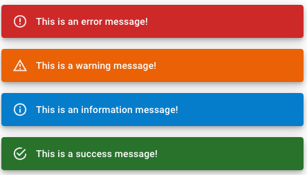

회사 업무로 스낵바 컴포넌트를 제작 업무를 맡게 되었는데<br />
npm package로 되어 있는 snackbar 컴포넌트들도 있었지만, 직접 만들고 싶어서 구현을 하게 되었습니다.<br />

### 스낵바(Snackbar) 컴포넌트란?

스낵바는 특정 작업(성공,실패,알림,정보 등)에 대한 가벼운 피드백을 제공하고,
일반적으로는 토스트와 비슷하게 사용되나 토스트와는 조금 차이가 있습니다. <br />
스낵바 컴포넌트는 **피드백을 제공**할 수 있을 뿐만아니라 유저가 스낵바 컴포넌트 내에서 **특정 액션을 취할 수 있다**라는 차이점이 있습니다.

<u>vs. 토스트 컴포넌트</u>
: 사용자의 액션이 필요하지 않은 메시지 또는 알림을 화면에 표시하는데 사용되며, 일정 시간이 지나면 자동으로 화면에서 제거가 됩니다.


설명에 앞서 구현된 패키지는 [react-snackbar-ui-customizable](https://www.npmjs.com/package/react-snackbar-ui-customizable)에 배포되어 있어요!

완성된 snackbar component 보고 가시죠!🎨 <br />

<video autoplay controls loop width="100%" muted="muted">
   <source src="./img/snackbar-demo.mov" type="video/mp4" />
</video>

<br />
<br />
<br />

<table>
<caption>Snackbar Component Example</caption>
<tr>
  <th>mui</th>
  <th>material ui</th>
</tr>
<tr>
  <td width="50%"></td>
  <td width="50%"></td>
</tr>
</table>

<br />
<br />

그러면 아래부터는 react-snackbar-ui-customizable 로 구현된 패키지에 대한 내용을 담아 보겠습니다.

# 스낵바 컴포넌트 기능
### 스낵바 컴포넌트가 등장하는 포지션 지정 기능
- `top-right`, `top-center`, `top-left`, `bottom-right`, `bottom-center`, `bottom-left`
- 각 포지션에서 발생하는 스낵바들마다 나타나는 위치가 자연스럽게 구현되었습니다.
  - right: 오른쪽에서 왼쪽으로 등장
  - left: 왼쪽에서 오른쪽으로 등장
  - top: 위에서 아래로 등장
  - bottom: 아래에서 위로 등장

### 스낵바가 자동으로 닫히는 타이머 기능(카운트 다운) 제공
- 특정 시간 이후에 종료되는 기능을 갖습니다. (default: 3초)
- 타이머 기능을 끄면 유저가 직접 닫기 버튼을 눌러서 스낵바 종료할 수 있습니다.

# 차별화된 기능
### snackbar method 구현 형태가 메소드 호출 형태로 구현
- hook을 이용한 useSnackbar형태로 사용이 쉽습니다
- useSnackbar 내부의 메소드(`on`, `off`)만 호출하여 쉽게 사용할 수 있습니다.
- 노출되어야 하는 snackbar component가 jsx내부에 존재하지 않아도 됨으로서 코드가 조잡해지지 않습니다.
  ```javascript
  const snackbar = useSnackbar()
  const onClick = () => snackbar.on({ title: '제목', message: '본문', type: 'SUCCESS' })
  ```

### 스낵바를 통해 더 정확한 정보 전달 기능
- 제목 뿐만 아니라 본문(message)을 포함할 수 있습니다 (제목, 본문 모두 optional로 동작합니다.)
- snackbar를 통해 유저에게 더 많은 정보를 제공 할 수 있습니다.

### 타이머 동작 제어 기능
- 발생하는 스낵바 컴포넌트에 마우스를 올리면(hover) 타이머 동작을 멈추게 할 수 있습니다
- 타이머 기능이 on 상태일 때에만 동작하며, 마우스를 컴포넌트에서 out하면 타이머가 재 작동 합니다.
- 전달하려는 정보의 양이 적고 화면이 작으며 타이머를 적게 유지한 경우에 사용되면 유용합니다.

### 타입별 스낵바 컴포넌트 스타일 커스터마이징 기능
- 스낵바 컴포넌트 스타일을 class 선택자로 customize 할 수 있습니다.
- 내부에 snackbar prefix로 구성된 className을 제공하고, 해당 className의 스타일을 변경하면 원하는 데로 변경할 수 있습니다.

### 타입의 아이콘 커스터 마이징 기능
- success, fail, info, warning에 대한 icon을 customize 할 수 있습니다.
- property로 제공되는 icon prop를 이용하여 custom icon 을 제공하면 변경 하여 사용할 수 있습니다.


# 그 외
## Typescript
- 타입 스크립틀 사용하여 type check를 strict 하게 지정하여 사용 (컴파일 에러를 통해 미리 버그 및 사이드 이펙트 예방)

## Storybook
- UI에 대한 경우의 수 테스트를 storybook으로 하였습니다.

## Jest, testing-library
- interface에 대한 반환 테스트 및 일부 구현에 대한 테스트를 수행합니다.

# 컴포넌트를 제작 하면서 느낀점
- 회사 업무를 하면서 누구나 한번쯤 만들어볼법한 재사용가능한 컴포넌트를 open source 하는 경험을 한것에 뿌듯하다.
- 내부적으로 개발하면서도 이미 잘 재사용 가능하도록 만들었다고 생각했지만, 문서를 만들고 demo 를 해보면서 도저히 이대로는 내놓지 못한다고 생각했다.
- 그래서 많은 부분 수정되었고, 좀 더 편하고 쉽게 변경 되었습니다. 이 부분에서 많이 고민하고 배웠던 것 같습니다.
- publish를 하고 난뒤 이상하게 첫주의 주간 다운로드가 400건 이상이 되면서, 버그가 발생하고 미흡하게 느껴졌던 부분을 수정하는게 최 우선순위가 되어서, 밤낮없이 코드를 들여봤던것 같습니다.

<br />
<br />
<br />

자세한 사용 및 interface에 대한 정의는 [README](https://www.npmjs.com/package/react-snackbar-ui-customizable)를 참고해주세요.

<!-- ### 해야할 리스트 -->
<!-- ✅ Storybook으로 Demo site 구축하기 -->
<!-- ✅ Timer 최적화 하기 -->