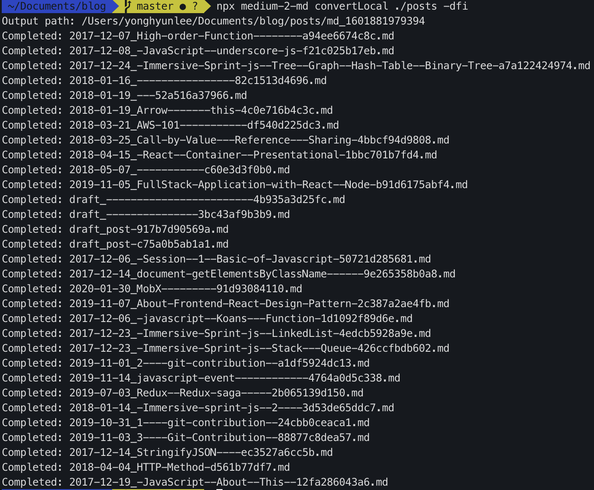

# 블로그 이사 및 Medium 이전

미디엄으로 블로그를 작성하다가, 어느새 바빠지고 귀찮아져서.. 블로그 작성을 조금 멀리 해왔다.
오랜만에 블로그를 작성하고 싶어서 작성을 하려고 하니 미디엄을 여러가지로 작성하는 법들이 불편하다는 것을 느꼈고 이번기회에 블로그 이사를 하기로 마음 먹었다!

[Gatsby](https://www.gatsbyjs.com/ 'Gatsby') 를 통해 블로그를 개발을 하기로 마음을 먹었으나 모든것을 직접 만드는 것은 포기아닌 포기를 했다.. 😅
블로그를 작성하려고 블로그를 만들다가 몇번이나 다른 업무에 치여서 지속적으로 못했던 과거의 내가 생각나서 이미 잘 만들어지고, 최소 필요 기능들이 들어가 있는 starter를 쓰기로 마음먹었다.
그중 내가 선택한 starter는 [한재협님의 Starter](https://github.com/JaeYeopHan/gatsby-starter-bee '한재협님의 Starter') 를 사용하기로 했다.

이 Starter를 고른 이유는 사이트가 정말 단순하고 깔끔하며, 태그 중심으로 화면이 구성되어 굉장히 심플하다. 현재는 이 버전으로 잘 쓰다가 추가적으로 필요하거나 디자인 변경이 조금씩 필요한 경우에는 고쳐서 쓰는 편으로 해야될 것 같다.

## Medium 이전

이번 블로그 이사를 하면서 꽤 편하고 좋았던 것이 있는데 Medium에 작성되어 있던 블로그를 Gatsby 사이트로 모두 이전 하였다. Gastby 초기 셋업은 [한재협님의 Starter](https://github.com/JaeYeopHan/gatsby-starter-bee '한재협님의 Starter') 를 보면 자세히 설명 되어 있기 때문에 따로 정리할 필요는 없을 것 같고 medium 이전에 대해 작은 팁을 첫 블로깅에 담을 생각이다.

### Medium Post Export

1. [Medium Post Export URL](https://medium.com/me/export 'Medium Post Export URL')에 진입 한다.
2. 사진에 Export를 눌러 Email 로 zip 파일을 전송 받는다.
   
3. 용량이 클수록 늦을수도 있는지 모르겠지만, 나 같은 경우에는 1~2분 정도 후에 메일을 받고 다운로드 받을 수 있었다.

### HTML(Medium) TO MD File

1. 파일 압축을 해제하면 여러개의 파일이 나오는데 그중 _post_ 디렉토리를 blog root에 옮겨 넣는다.
2. [medium-2-md](https://github.com/gautamdhameja/medium-2-md 'medium-2-md') package를 이용한 파일 변환

```bash
$ npx medium-2-md convertLocal ./posts -dfi
```

3. 명령어 실행 후 아래처럼 된다면 성공!
   

4. posts path 아래에 **md_xxxxx** 라는 파일 경로 아래로 md 파일과 img 파일(포스트에 이미지가 있었을 경우에) 생성된다.
5. blog md 파일이 놓여 있는 content 하위에 변환된 md 파일들을 배치한다.
