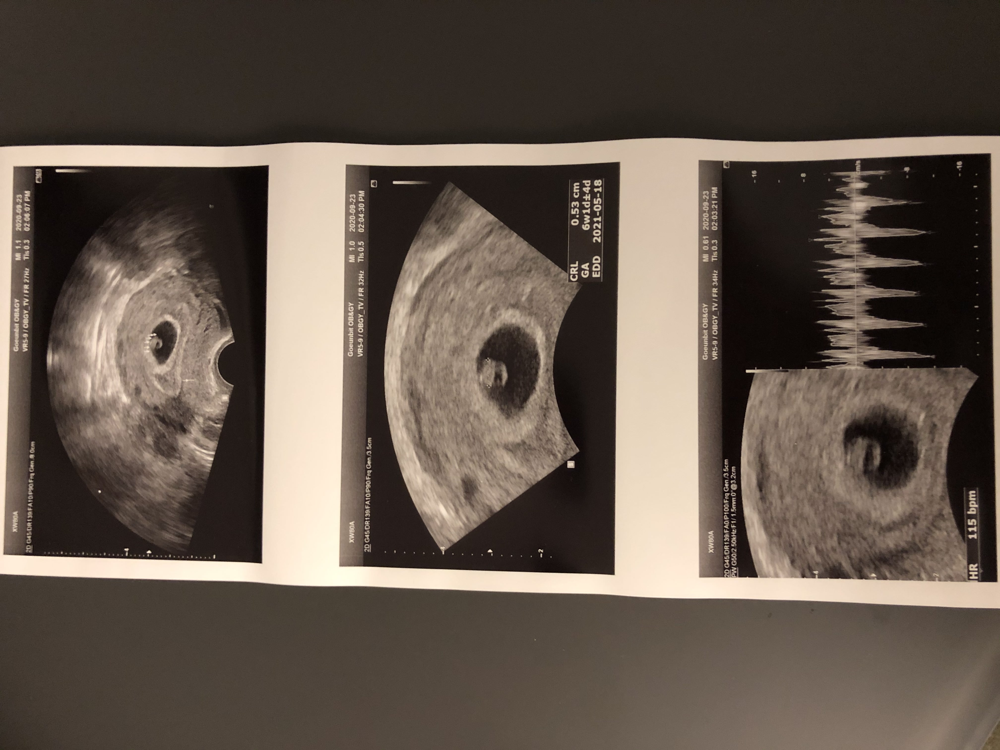
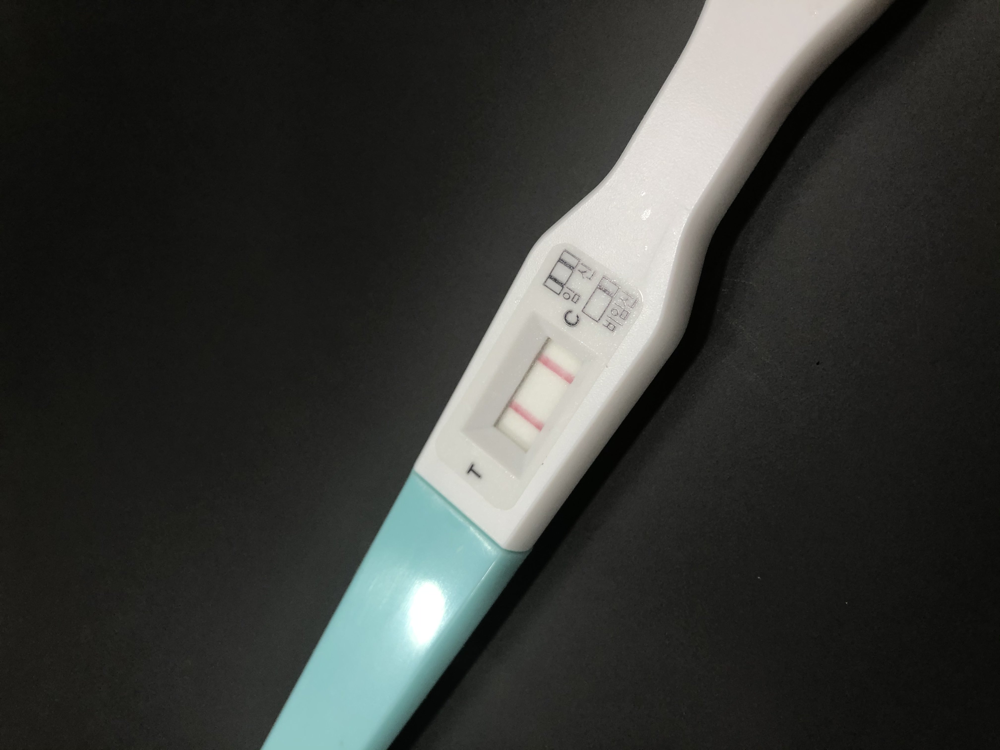

  

우리가 결혼을 하면서 서로 2세에 대한 생각은 하고 있었는데, 언제 아이를 가져야 할지 계획을 잡기가 어려웠다.  
근데 마침 와이프가 이직한 회사가 어린이집을 지원해주는 복지가 있어서 준비를 하게 되었다.  
준비를 하고 있었기 때문에 아내의 변화를 보고 임신일까(?) 라는 준비된 반응들을 할 수 있었고, 임신테스트기에서 양성 반응이 나오게 되었다.  

  

급하게 생각하지 않고 그 주 주말에 송파고은빛산부인과에 예약을 하고 검진을 받았다.  
검사를 해보니 0.53cm 짜리 아주 작지만 강하게 뛰고 있는 수박이를 발견하였다. 너무 신기했다.  
그동안 임신한 분들을 봐도 별 감정 없었는데, 두개의 심장이 한 몸에서 뛰고 있다니.. 그리고 내가 아빠가 된다니..  
실감이 안났다. 검사결과는 정상이지만 심박수가 115bpm으로 정상 수치까지는 아직 못 올라왔다고 했다. 우리가 심장이 생기자마자 간듯..?  
안정 수치는 130이상으로 올라와야 한다고 한다.

아이가 생기면서 코로나도 있고 추석에는 조심히 지내야겠다.