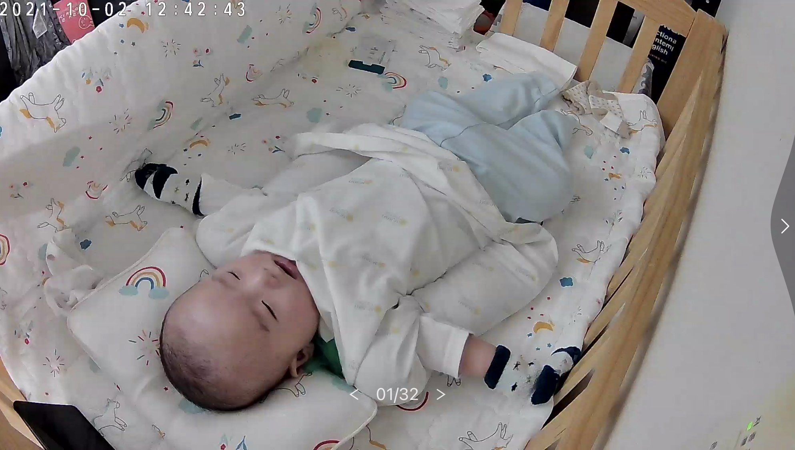

오랜만에 일기를 쓴다.
이제는 작지만 큰 변화들을 하나하나 기록해보려고 한다.

그 동안 부지런하지 못하게 적지 못했지만.. 이제부터라도 차곡차곡 기록해보자.

120일 쯔음에(정확히는 119일) 수현이는 뒤집었고, 뒤집은 이후로는 생활이 많이 변했다. 눕히기만 하면 뒤집으려고 하고 뒤집어서 놀면 침을 질질..
그리고 모든 장난감을 입에 넣어봐야하고, 자기 입주변으로온 모든 것을 빨고 혀로 문지른다. (특히 얼굴 근처에 손을 갖다대면 혀로 다 침범벅ㅋㅋ)

자기의사 표현이 강한지라 졸리고 놀고 싶고 자고 싶지 않음을 분명하게 표현한다. 
시간마다 강제로 재울수도 없기 때문에 졸리다고 표현하면 (보통은 눈이 졸린눈으로 변하고, 눈쪽에 손을 계속 올린다.) 바로 재운다. 그럼 빠르면 1초 컷도 된다

하루하루 커가는게 느껴지고, 이제는 사람도 아는것 같다.

난 재택을 하다가 한번씩 수현이를 보면 수현이가 날 알아보고 엄청 함박웃음을 짓는다.
업무를 고민하면서 스트레스 받던 것이 그 순간은 확실히 다 날라간다 ㅎㅎ

너무 귀엽고 사랑스럽다. 엄마만 괴롭히지 말기를. 

  

