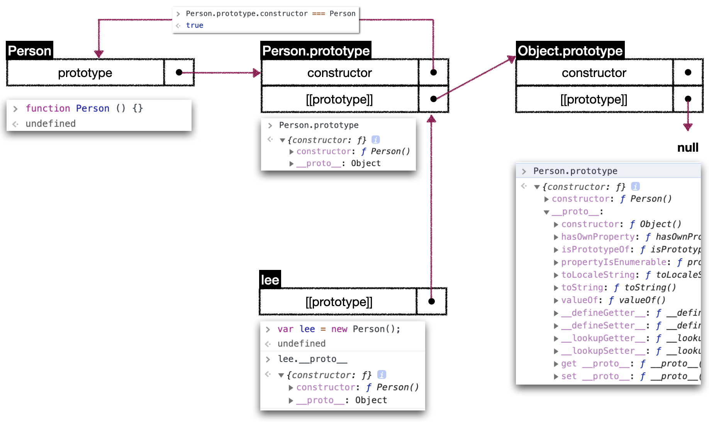

# 자바스크립트
자바스크립트는 __1)객체 지향 언어__ 이지만 다른 class 지향 언어와 달리 프로토타입 기반 언어라고 부른다. 
이러한 것을 __2)프로토타입기반 프로그래밍(Prototype-based programming)__ 이라 한다.

### 1) 객체지향 프로그래밍(Object-oriented programming)
__관계성있는 객체들의 집합이라는 관점으로 접근하는 소프트웨어 디자인__ 으로 볼 수 있다. 각 객체는 메시지를 받을 수도 있고, 데이터를 처리할 수도 있으며, 또 다른 객체에게 메시지를 전달할 수도 있다. 각 객체는 별도의 역할이나 책임을 갖는 __작은 독립적인 기계로 볼 수 있다.__

### 2) 프로토타입 기반 프로그래밍(Prototype-based programming)
프로토타입 기반 프로그래밍은 클래스가 존재하지 않는 객체지향 프로그래밍의 한가지 스타일이다.
class를 사용하는 객체지향 언어에서는 상속을 사용하며 상속은 기본으로 복사를 수반하지만, 자바스크립트는 객체 프로퍼티를 복사하지 않는다. 대신 __두 객체에 링크를 걸어두고 한쪽이 다른쪽의 프로퍼티 또는 함수에 접근할 수 있게 위임__ 한다. 

<br />
<br />

# 프로토 타입 (Prototype)

기본 데이터 타입을 제외한 모든 것은 __객체__ 로 이루어져 있는데 __객체__ 가 만들어지기 위해서는 자신을 만드는데 사용된 원형(Prototype)인 Prototype Object을 이용하여 만든다.  
프로토 타입은 크게 __Prototype Object__ 와 __[[Prototype]]__ 으로 구성 된다. [[Prototype]] 은 Prototype Link 라고도 부른다.

### Prototype Link - [[Prototype]]
자바스크립트 객체(Object)는 [[Prototype]] 이라는 내부 프로퍼티가 있고, 다른 객체를 참조하는 단순 레퍼런스로 사용한다.  
예를 들면 human 이라는 함수가 존재 한다고 하자. 
human 객체를 console로 찍어보게 되면 \_\_proto\_\_ 라는 key 값이 존재(chrome기준)하고 함수를 메소드로 가지고 있다. 이말은 human 이라는 함수는 자신의 함수(human)이 만들어지기 위하여 원형 (Function) 프로토타입 객체를 이용하여 만들었다. 조금 더 보면 Image의 밑에서 5번째 줄에 \_\_proto\_\_가 하나 더있다. Function 이라는 원형 함수(자바스크립트 내장 프로토타입)는 **Object Prototype 객체**를 링크 하고 있다.  


#### 프로토타입 체이닝
위처럼 객체에서 속성 (Property)를 검색할 때 [[Prototype]] 연쇄를 한번에 한 링크씩 계속 찾고, 결국 내장 프로토타입 **Object.prototype**에서 끝이 난다. <br />
Object까지 찾고 값이 없다면 undefined를 리턴한다. 
<br />  

### Prototype Object
최상위 Object의 prototype object를 의미 한다.  
모든 자바스크립트 객체는 Object.prototype 객체의 자손 이다.

다음은 Prototype 연결 구조를 표현한 그림이다.

1. **Person 이라는 객체를 생성 하였다.**  
Person 객체는 별다른 property는 없으나 기본적으로 생성시에  
   1) 해당 함수에 Constructor(생성자) 자격을 부여하며 new를 통해 객체를 만들어 낼수 있도록 하며,
   2) 해당함수의 prototype object 생성 및 연결을 한다.
```javascript
function Person () {}
```

2. **Person의 prototype은 constructor 와 [[prototype]]을 포함한다.**
   1) constructor는 Person 자기 자신을 가리킨다
   2) [[prototype]]은 자신의 부모를 가리킨다. 여기서 부모는 Object이다. 

3. **Object prototype은 최상위 부모 객체이며 상위 Linking이 null이다.**

4. **부모객체(Person)으로 부터 lee 라는 새로운 객체를 생성하면 [[prototype]]이 Person.prototype에 링크 된다.**

<br />
<br />

# 공부하면서 추가로 알게된 내용
1. prototype Linking을 하면서 생성된 부모 자식간 관계는 말그대로 연결된 링크를 위임하는 것이다. 그래서 spread 연산자나, Object.create와 같은 메소드를 사용하게 되면 Link가 연결이 끊기게 된다.
```javascript
// Person 객체 생성 및 prototype에 eye 객체 추가 
function Person () {}
Person.prototype.eye = 2;
// Person 객체를 이용한 man 객체 생성 & man 객체에 hand property 추가
//
var man = new Person();
man.hand = 2;
console.log(man.eye, man.hand) // 2, 2
//
var newMan = { ...man }; 
var newMan2 = Object.assign({}, man);
console.log(newMan.hand) // 2
console.log(newMan.eye) // undefined
console.log(newMan2.hand) // 2
console.log(newMan2.eye) // undefined
```

2. 함수 앞에 new를 붙여 생성자 호출을 하게 되면 일어나는 일
   1. 새로운 객체가 만들어 진다.
   2. 새로 생성된 객체의 [[Prototype]]이 연결된다.
   3. 새로 생성된 객체는 해당 함수 호출시 this로 바인딩 된다. 
   4. 자신의 또 다른 객체를 반환하지 않는 한 new와 함께 호출된 함수는 자동으로 새로 생성된 객체를 반환한다.


<br />
<br />

---
### reference

#### Link
1) https://developer.mozilla.org/ko/docs/Web/JavaScript/Introduction_to_Object-Oriented_JavaScript  
2) https://medium.com/@bluesh55/javascript-prototype-%EC%9D%B4%ED%95%B4%ED%95%98%EA%B8%B0-f8e67c286b67  

#### 서적
1) You Don't Know JS: this와 객체 프로토타입, 비동기와 성능