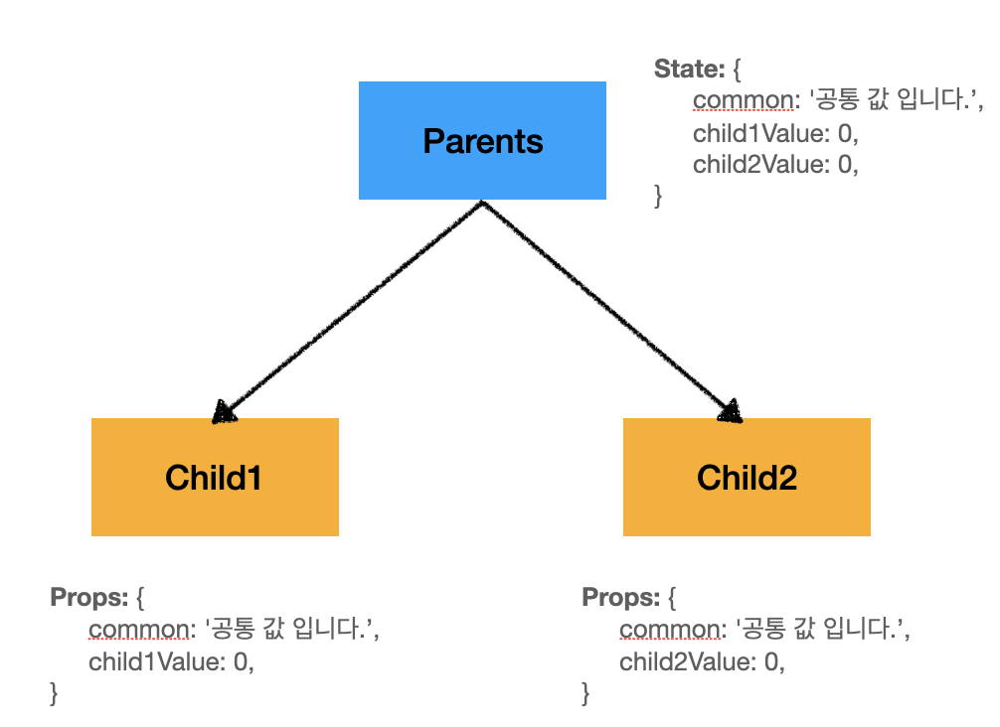
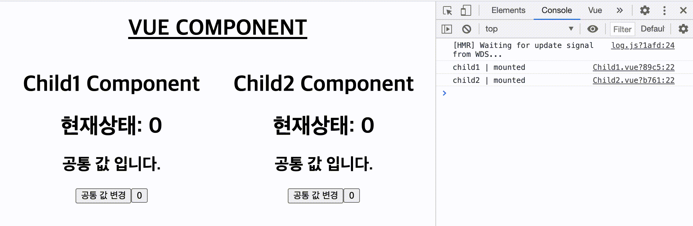
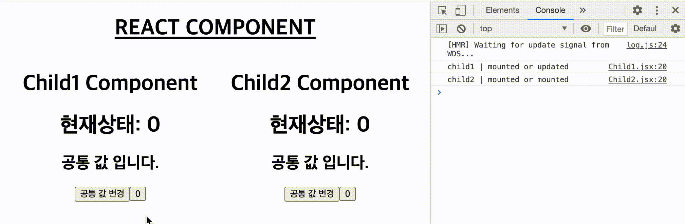

이번 회사에 입사하기 전까진 React이외에 Angular나 Vue를 따로 공부해본적이 없었다. 그땐 리액트를 조금 더 하드하게 쓰고 싶었고 잘쓰는 방향을 연구하는게 더 즐거웠었다.  
그런데 이번에 입사한 힐링페이퍼에서는 Frontend 주 기술 스택으로 Vue로 통합 하고 있다. 기존의 Legacy React코드도 Vue로 옮겨지고 있다.  
Vue를 쓰는걸 알고 입사했고, 여러 방향으로 요즘 트렌드 라이브러리의 장점과 단점들을 학습하고 싶었다.  

Vue에서는 장점이 굳이 최적화작업을 하지 않아도 굉장히 빠른 웹 어플리케이션을 짧은 코드로 작성 할 수 있다. 이를 작게나마 확인해보기 위해서 다음과 같은 가설을 두고 테스트를 진행하였다.  

1. Vue가 React보다 쉽게 최적화 컴포넌트를 만들 수 있을까?
2. 있다면 얼마나 짧은 코드로 표현 될수 있는가?
3. 또 반대로 React가 Vue와 동일한 Life Cycle을 가진 최적화 컴포넌트를 가지려면 어떻게 customizing을 해야하는가?
<br />
<br />
<br />
---
<br />
<br />
<br />

# 테스트 컴포넌트 구조 및 설명
**간단한 컴포넌트를 만들기 위해서 아래와 같은 구조로 작성하였다.**


- Parents는 Child1, Child2에서 쓰일 모든 값들을 갖고 있습니다.
- 그중 common이라는 공통 property가 있고, 각각 Child는 자신에게만 필요로 하는 속성 값을 가집니다.(Child1: `child1Value`, Child2: `child2Value`)
- 자신이 갖고 있지 않은 property가 Parents에서 변경되었을 때 React, Vue는 어떻게 반응하고 렌더링 되는지 확인해 봅니다.
- 해당 블로그에는 간단한 설명만 내포합니다. 자세한 코드는 하단에 github code를 참고해주세요!

# Vue가 React보다 쉽게 최적화 컴포넌트를 만들 수 있을까?
## React
**결론**: Parent의 state 값이 변경되면 child 컴포넌트 1,2 모두 자신에게 종속된 property와 관계없이 항상 렌더링 된다.

- Parents component 에서 각각 Child1, Child2 component에 필요한 props만 내려준다.


```javascript
// Parent.jsx
import { useState } from 'react';

import Child1 from './Child1'; 
import Child2 from './Child2';
import './styles.css'

const Parents = () => {
  const [common, setCommon] = useState('공통 값 입니다.');
  const [child1Value, setChild1Value] = useState(0)
  const [child2Value, setChild2Value] = useState(0)

  return (
    <div className="wrapper">
      <div className="child1">
        <h1>Child1 Component</h1>
        <Child1
          common={common}
          handleCommon={setCommon}
          child1Value={child1Value}
          handleChild1Value={setChild1Value}
        />
      </div>
      <div className="child2">
        <h1>Child2 Component</h1>
        <Child2
          common={common}
          handleCommon={setCommon}
          child2Value={child2Value}
          handleChild2Value={setChild2Value}
        />
      </div>
    </div>
  )
}

export default Parents;
``` 


- 공통값 변경시에는 두 컴포넌트 모두 렌더링 된다.
- 각각 child component의 숫자버튼을 클릭하면 각 컴포넌트의 value값 (child1Value, child2Value)이 증가 하는데, 어떤 숫자를 눌러도 두개 컴포넌트 모두 렌더링 된다.
- `child1Value` 라는 값이 변경되었을 때 Child1 component만 렌더링 되어야 하는데 Child2 component까지 렌더링 되는 이슈가 있으므로 이 부분을 해결할 필요가 있다.


## Vue
**결론**: Parent의 state 값이 변경되었을 때 child 컴포넌트에서는 자신이 가진 property가 있을 경우에만 렌더링 한다.

- Vue도 React와 마찬가지로 Parents component 에서 각각 Child1, Child2 component에 필요한 props만 내려준다.

```javascript
<template>
  <div class="wrapper">
    <div>
      <h1>Child1 Component</h1>
      <child1
        :common="common"
        :child1Value="child1Value"
        @handle-common="setCommon"
        @handle-child1-value="setChild1Value"
      />
    </div>
    <div>
      <h1>Child2 Component</h1>
      <child2
        :common="common"
        :child2Value="child2Value"
        @handle-common="setCommon"
        @handle-child2-value="setChild2Value"
      />
    </div>
  </div>
</template>

<script>
import Child1 from './Child1'
import Child2 from './Child2'

export default {
  data() {
    return {
      common: '공통 값 입니다.',
      child1Value: 0,
      child2Value: 0,
    }
  },
  components: {
    Child1,
    Child2,
  },
  methods: {
    setCommon: function (newText) {
      this.common = newText;
    },
    setChild1Value: function (value) {
      this.child1Value = value;
    },
    setChild2Value: function (value) {
      this.child2Value = value;
    },
  }
}
</script>
```


- 공통값 변경시에는 두 컴포넌트 모두 렌더링 된다.
- React와 다르게 `child1Value` 값을 변경 시켰을 때 child1 component만 리렌더링이 발생하고 child2 component는 리 렌더링이 발생 되지 않는다. (그 반대도 마찬가지)
- 따로 손 본게 없지만 자동으로 렌더링 최적화를 하고 있다.

# 얼마나 짧은 코드로 표현 될 수 있는가?
위 코드로 봤을 때 코드의 양은 React나 Vue나 그들만의 문법이 있을뿐 실제로 코드의 양은 그렇게 차이는 없다. 다만 React에서는 렌더링 최적화가 해결되지 않은 상태로 렌더링이 발생하고 있고 Vue에서는 렌더링 최적화가 알아서 잘 되어 있는 것으로 보인다.

## 요약
### React
- Parent component의 state 값이 업데이트가 되면 자식 노드가 모두 리 렌더링이 발생한다. (Bad!! 👎)
- <u>__이것을 해결하기 위해선 기존 버전에 존재하던 `shouldComponentUpdate` 와 같은 비교 라이프사이클을 이용하던가(현재는 deprecated 됨), 아니면 `PureComponent` or `React.memo()` 를 이용하여야 한다.__</u>

### Vue
- Parent component의 state 값이 업데이트가 되더라도 자신 노드에서 자신이 가진 property가 아니면 해당 컴포넌트를 리 렌더링 하지 않는다. 
- Vue는 자동으로 최적화를 한다. (Good!! 👍)

# 그럼 이것을 어떻게 React에서도 동일하게 구현 할까?
굉장히 간단하다. `React.memo()`를 사용하여 child 컴포넌트가 받고 있는 props의 shallow compare를 통해 변한 값이 있을 때에만 리 렌더링을 하도록 하면된다. 

```javascript
import { useEffect, useCallback, memo } from "react";

const Child1 = (props) => {
  // ... 생략 ...
  return (
    <div>
      <h1>현재상태: {child1Value}</h1>
      <h2>{common}</h2>
      <button onClick={onCommonClick}>공통 값 변경</button>
      <button onClick={onChild1ValueClick}>{ child1Value }</button>
    </div>
  )
}

// 아래처럼 React의 memo로 해당 child 컴포넌트를 감싼다.
export default memo(Child1);
```

- 위 처럼 Vue 컴포넌트처럼 리렌더링이 최적화 되어 동작 한다.

## 요약
React에서 `React.memo`를 사용하여 Child 컴포넌트의 자신의 props의 변화가 없다면 (기존 props와 새로 인입된 props) 리 렌더링 하지 않는 방식으로 vue와 동일하게 리 렌더링 최적화를 할 수 있다. 

# 글을 작성하면서
리액트에서의 `memoization` 기법은 실제로 유용하지만(useCallback, useMemo 등...), 언제나 쉽게 변하는 컴포넌트, 변수 혹은 함수에 memo를 모두 선언해서 사용한다는건 어쩌면 더 안 좋은 패턴이 될 수도 있다. (오히려 더 많은 메모리를 사용하고 코드가 복잡해질수도 있다고 생각한다.)  
memoization 기법을 쓰기 위해 어느정도의 빈번한 렌더링을 기준으로 잡고 써야 하는지는 조금 더 연구가 필요할 것 같다.  
근데 Vue는 이런 부분에선 참 편한것 같다.!! 

### reference
<a href="https://www.github.com/lyhlg" target="_blank">Github Code Link</a>