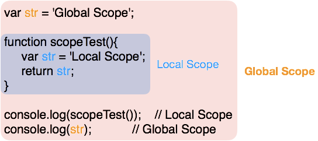

\[Session #1\] Basic of Javascript

### 변수

1.  변수의 이름은 애매하지 않고 확실하게 정해주는 것이 좋다.
2.  var / let / const 과 같은 것으로 변수를 선언 한다.
3.  긴 변수의 이름은 Camel Case를 이용한다. _(ex> limitOfNumber)_
4.  변수 선언시에는 스코프를 고려한다.

#### 스코프

변수가 소스코드 스크립트 안의 어떤 곳에서 참조 할 수 있는지를 결정하는 개념이며, JavaScript에서는 두 가지의 스코프로 분류 할 수 있다.

- Global Scope : 함수 바깥에서 선언한 변수
- Local Scope : 함수 내부에서 선언한 변수

Local Scope 와 Global Scope

#### console.log(scopeTest())

- scopeTest() 함수는 내부에서 local scope로 사용될 str 변수를 선언해 두고 있다.
- scopeTest() 함수 내에 있는 str변수는 scopeTest() 함수 내에서만 사용되게 되며, Local Scope에 해당하는 str 값을 return 해주게된다.
- var str = ‘Local Scope’; 는 함수내에서 선언한것이고, 글로벌 변수 str에는 영향을 미치지 않는다.
- 다만, str = ‘Local Scope’와 같이 변수 재선언을 하지 않고 글로벌 변수를 가져다 쓸 경우에는 글로벌 변수가 담고 있는 값이 ‘Global Scope’ 에서 ‘Local Scope’로 변경이 되니 주의 해서 사용해야 한다.
- 가능하면 변수를 사용할 때마다 let(블록유효범위를 갖는 지역변수)을 통해 선언하는 것이 바람직하다.

#### console.log(str);

- str을 console.log로 출력할 경우에는 global로 선언 되어 있는 str을 출력하게된다.

### Logical Operators

#### Logical Not

!true // false  
!(3<2) // true

#### OR

true || true // true  
false || true // true  
false || false // false

#### AND

true || true // true  
false || true // false  
false || false // false
