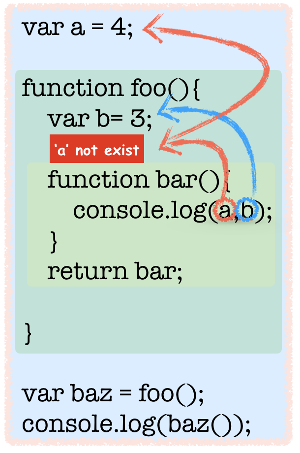

> codestates에서 첫번째로 받은 과제는 koans 과제였다.  
> 쉬운 부분도 있지만, 어려웠던 부분과 표현이 생소한 부분들을 정리해 보았다.

### function

어려움을 겪었던 문제는 가장 아래에 포스트해두었다.  
실제로 문제를 풀면서 막혔던 문제를 바로 접근하기보다는 Closure에 대한 개념을 다시 잡고 제시된 문제를 접근하기로 했다. 아래는 Closure에 대한 기본 개념이다.

#### Closure

1.  포함하고 있는 외부함수의 변수에 접근할 수 있는 내부함수
2.  Scope Chain이라고 표현 되기도 한다.

- 클로저 자신에 대한 접근 ( 자신의 블럭 내에 정의된 변수 )
- 외부 함수의 변수에 대한 접근 ( 파라미터도 접근 가능 )
- 전역변수에 대한 접근

var a = 4;  
function foo(){  
 var b= 3;  
 function bar(){  
 console.log(a,b);  
 }  
 return bar;  
}  
var baz = foo();  
console.log(baz()); // 4,3

위의 코드는 클로저의 예 이다. 단계별로 살펴보자

1.  foo()를 실행한 결과를 baz 라는 변수에 넣고 있다.

var baz = foo();

2\. foo를 실행한 결과가 bar 함수를 리턴해 주고 있다.

function foo(){  
 var b= 3;  
 function bar(){  
 console.log(a,b);  
 }  
 **return bar;**  
}

3\. baz 라는 변수에는 bar 함수를 포함한다.   
 ( baz 변수가 갖고 있는 값을 다시쓰면 아래처럼 된다.)

var baz = function bar(){  
 console.log(a,b);  
 }

4\. 여기서 아래 console.log를 찍게되면 어떻게 될까?

console.log(baz());

5\. 실제로 bar 함수는 변수 a와 b를 포함하고 있지 않다. 여기서 클로저의 정의를 다시보자

> 클로저 자신에 대한 접근 ( 자신의 블럭 내에 정의된 변수 )

> 외부 함수의 변수에 대한 접근 ( 파라미터도 접근 가능 )

> 전역변수에 대한 접근

5–1. 먼저 자기자신에 대한 접근을 통해 변수 a와 b를 찾는다. (하지만 없다.)

5–2. 그럼 외부 함수의 변수에 접근한다. 본인을 포함하고 있는 외부함수 foo()가 b라는 변수를 갖고 있고 3이라는 값을 포함하고 있다.

function foo(){  
 **var b = 3;**  
 function bar(){  
 console.log(a,b);  
 }  
 return bar;  
}

5–3. 그리고 아직 a의 값에 대해 찾지 못했다. a라는 값을 찾기 위해 전역변수에 대해 접근을 한다. 전역변수에 a 변수가 4라고 선언되어있다.

**var a = 4;**  
function foo(){  
 var b= 3;  
 function bar(){  
 console.log(a,b);  
 }  
 return bar;  
}  
var baz = foo();  
console.log(baz());

6\. 위와 같은 scope chain을 통해 변수의 값들을 찾을 수 있다. **결과는 4,3 을 출력**한다.

위를 통해 아래의 문제를 쉽게 찾을 수 있다.

function makeIncreaseByFunction(increaseByAmount) {  
 return function (numberToIncrease) {  
 return numberToIncrease + increaseByAmount;  
 };  
}

var increaseBy3 = makeIncreaseByFunction(3);  
var increaseBy5 = makeIncreaseByFunction(5);

console.log(increaseBy3(10) + increaseBy5(10)); // 13 + 15 = 28

위와 방식은 동일하기 때문에 위 문제를 이해하는데에는 어렵지 않았다.

비슷한 예제가 [mdn에 예제](https://developer.mozilla.org/ko/docs/Web/JavaScript/Guide/Closures)로 실려 있어서 참고도 하였다. (링크참고)

아래는 내가 이해한 방식을 그림으로 그려보았는데 나중에 내가 이글을 읽고도 이해가안될까봐.. 노파심에 그려보았다.

Closure에서 접근방법
