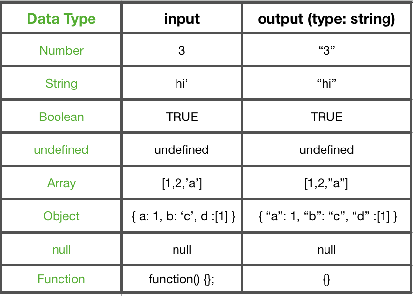

StringifyJSON 구현

### stringifyJSON 함수란?

자바스크립트 값을 JSON 문자열로 변환한다.

더 자세히 말하면 **Object 나 Array를 받았을 경우** 모두 string으로 변환해주는 함수이다.

문법을 보면 아래와 같다.

> JSON.stringify(value \[, replacer \[, space\]\])

위처럼 세 개의 인자를 받게 되는데 자세한 내용은 [mdn문서](https://developer.mozilla.org/ko/docs/Web/JavaScript/Reference/Global_Objects/JSON/stringify)를 참고 하자.

내가 여기서 **구현한 내용은 value값을 받았을 때에 처리 방식만 고려**하였고 나머지 인자는 모두 optional 하게 동작하므로 여기서 구현하지는 않았다.

각 타입별 출력 기대값

### Input Data type

**Object** 일 때와 **Array**일 때 그리고 미약하지만 **Function** 일 때는 약간의 주의사항이 존재한다.

**Function 고려사항**

- Function을 만나게 되면 무조건 결과는 이전 결과를 무시하고 ‘{}’ 빈 Object가 출력된다.

**Object 고려사항**

- Object 의 property가 method일 경우 (value가 function을 갖는 형태) -> 기존의 값이 무엇이 있든 ‘{}’이 출력된다.
- Object 의 value가 Object일 경우 또는 배열일 경우

**Array 고려사항**

- Array가 이중 배열 또는 그 이상일 경우 ( \[0,1,\[0,1,\[0,1\]\]\] )

> **Object와 Array에서 발생하는 문제 때문에 자기 자신을 계속 호출해가며 낱개가 나올 때까지 재귀를 돌릴 필요가 있다.**

> 전체적인 틀은 크게 아래 세 가지로 나눈다.

#### Object나 Array가 아닌 경우

- null / undefined / boolean / number 인 경우
- string(얘만 앞뒤로 **“ “** 가 필요하므로 따로 분류)인 경우

#### Array인 경우

- 각 인덱스마다 for문을 돌려 자기 함수를 호출하며 인덱스의 값을 1번 항목에 매칭 시키는 게 목적
- 만약 해당하는 인덱스의 값이 배열이거나 객체일 경우에는 2번 3번에 매칭 되며 재귀 재 호출

#### Object인 경우

- 각 key값마다 for문을 돌려 자기 함수를 호출하며 인덱스의 값을 1번 항목에 매칭 시키는 게 목적
- 만약 해당하는 인덱스의 값이 배열이거나 객체일 경우에는 2번 3번에 매칭 되며 재귀 재 호출
- 만약 value 값으로 function을 받을 경우에는 “ {} “ return

나는 아래와 같이 소스코드를 작성 하였다.

(물론 좋은 소스코드가 아닐 수도 있지만 기록 차원에서 남겨둔다.)

var stringifyJSON = function(obj) {  
 let result = "";  
 if( obj == null || obj == undefined || typeof obj == 'boolean' || typeof obj == 'number' ){  
 return "" + obj;  
 }  
 // string  
 else if ( typeof obj === 'string' ){  
 return "\\"" + obj + "\\"" ;  
 }  
 // Array  
 else if( Array.isArray(obj) ){  
 if(obj\[0\] === undefined){  
 return "\[\]";  
 }  
 else{  
 for ( let i = 0 ; i < obj.length ; i ++ ){  
 if ( i !== obj.length-1) {  
 result += stringifyJSON(obj\[i\]) + ',';  
 }  
 else{  
 result += stringifyJSON(obj\[i\]);  
 }  
 }  
 result = "\[" + result + "\]";  
 }  
 }  
 // object  
 else if ( obj.constructor === Object ){  
 for ( var i in obj ){  
 if (i === Object.keys(obj)\[Object.keys(obj).length-1\] ){  
 result += stringifyJSON(i) + ":";  
 result += stringifyJSON(obj\[i\]);  
 }  
 else {  
 if ( obj\[i\].constructor === Function ){  
 return "{}";  
 }  
 result += stringifyJSON(i) + ":";  
 result += stringifyJSON(obj\[i\]) + ",";  
 }  
 }  
 result = "{" + result + "}";  
 }  
return result;  
};

var obj = {a:'b', b:function(){}, c : \[1,2,3,\[1,'a'\]\]};  
console.log(stringifyJSON(obj));
