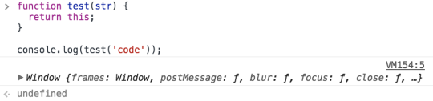

This하면 여러개의 기초 개념들을 알고 있어야 하는데, 지금 막 떠오르는 단어들은 Closure, 함수의 메소드인 call, apply 정도가 생각난다.물론 기초도 부족하지만 this를 공부하다보니 어느정도 정리가 되어 가는것 같아 이해한 부분까지 정리를 한다.

this 에 대한 이해부분은 워낙에 범위도 넓고 예외적인 상황도 있는 것 같아 이번 포스팅에서 모든걸 정리할 수는 없을 것 같다.

그래도 어느정도 초보자 관점에서 이해를 돕고자 정리한다.

먼저 나는 많은 언어를 다뤄보지는 않았지만, (다뤄봤다 하더라도 학부때 다뤘던 C나 java가 전부..) 상식선에서 javascript의 this 라는 단어가 이해가 되지 않았다.

만약 함수 내부에서 this를 호출하게되면 해당 함수 내부에서 실행이 되었기 때문에 당연히 함수 object가 this가 가리키는 것이 될줄 알았다.

물론 그런 경우도 있지만 아닌 경우도 있다.

this를 정의하자면 아래와 같이 정의할 수 있다.

> “this”는 생성자라는 문맥에서 생성되는 인스턴스를 나타낸다.

위 말 뜻으로는 이해가 조금 덜 갈수도 있어서 아래와 같이 분류를 하고 this가 가리키는 것을 하나씩 짚어보자.

### global ( window )

> This는 Default로 global 객체 window를 가리킨다.

첫번째로 생성자를 통해 인스턴스를 생성하지 않았을 경우 일반적으로는 this는 모두 global 객체를 가리키게 되어있다.

this가 가리키는 대상이 global일 경우 Atom에서 실행하면 undefined가 떠서 위의 뜻을 정확하게 이해하지 못했었다.

하지만 Chrome을 이용해서는 위 내용을 확인해 볼 수 있었다.

아래는 Chrome Console을 이용하여 test라는 function을 생성하고 내부에서 this가 가리키는 값을 찍기 위한 아주 간단한 코드이다.

global this

위처럼 this는 Global 객체인 window를 가리키고 있다.   
( Atom에서 같은 테스트를 해보면 undefined가 발생된다. 참고!)

> 그래서 this는 생성자를 통해 생성되지 않았거나, 밑에 설명할 나머지 조건들에 충족이 되지 않으면 Global 객체인 window를 가리키게 된다.

### Method

> method에 사용되는 this는 자기 자신을 나타낸다.

javascript에서 bulit-in 되어 있는 javascript object 들이 있으며   
_(ex> String, Array, Boolean, Math ….)_

*이러한 bulit-in object들은 각각 메소드를 갖고 있다.*   
_(ex> push(), pop(), toString …)_

이러한 Method들을 사용하는 방법은 모두 잘알겠지만, `arr.push(3)` 로 예를 들어 보겠다.

arr.push(3) 란 **“arr(target) 라는 배열 인수값을 가진 놈의 배열의 끝에 3 이라는 숫자 값을 붙이겠다.”** 라고 이해할 수 있다.

그리고 arr은 어떻게 생성되었는가 하면 `var arr = new Array();`로 하여 Array라는 javascript가 가지고 있는 constructor를 arr가 그대로 상속 받아서 Array가 가지고 있는 메소드들을 모두 사용 할 수 있게 한다.

위처럼 Array Object를 new로 하여 arr가 상속 받게 되는 구조는 위에서 설명한 This의 개념과 부합하게 된다.   
(”this”는 생성자라는 문맥에서 생성되는 인스턴스를 나타낸다.)

조금더 설명을 하자면 Array 라는 Object도 내부적으로 함수를 가지고 있어서, 해당 메소드로 호출 될때 메소드에 해당하는 결과값을 리턴하게 될텐데 그 함수 안에서도 this를 사용하게 된다. 이 때 가리키는 this는 자기 자신을 나타내게 된다.

사실 이부분은 this의 개념으로만 알고 있으면 될것 같다.

### call,apply

> Function 의 method인 call이나 apply는 this의 범위를 지정해 주기 위한 메소드 이다.

- 이해를 돕고자 아래는 함수 사용 구문이다.
- 링크를 따라가면 위키피디아를 확인 할 수 있다.  
  [\[fun.call(thisArg\[, arg1\[, arg2\[, …\]\]\]\]](https://developer.mozilla.org/ko/docs/Web/JavaScript/Reference/Global_Objects/Function/call)

call, apply 이해하는데 상당히 까다로웠으나, 초보개발자로서 이해범위를 약간 줄여서 이해한 부분들을 설명한다.

먼저 처음에 Global을 설명 할때 사용한 예제를 사용해서 예를 들어 보면 이렇다.

function test(str) {  
 return this;  
}  
console.log(test);

위에서 this가 가리키는 것은 window global 객체를 가리키고 있다.

근데 만약에 call 메소드를 써서 this가 가리키는 곳을 지정해 줄수 있다.

아래 예제를 보자.

function test(str) {  
 return this.a;  
}  
var obj = {  
 'a' : 1  
};  
console.log(test.call(obj)); // 1

위 코드의 결과값으로는 ‘1′이 찍히게된다. 이유는 call 명령어를 사용하여 this가 가리키는 곳(obj)을 지정해주었고 test함수에서 this.a를 return 했을 때 obj 객체에 있는 a 키값을 가진놈을 호출하게 되어 1이 리턴되게 된다. call이나 apply 함수는 첫번째 인자값으로 null을 default 값으로 가진다.

### new constructor

생성자를 통해 새로운 인스턴스를 생성했을때, 그때 this는 인스턴스를 나타낸다.

비슷한 내용을 method에서도 했는데, 위키피디아에 있는 예제를 보며 설명을 하겠다.

아래는 Product 라는 함수 객체와 Food라는 함수 객체를 생성 한 후 Food라는 생성자를 통해 cheese라는 인스턴스를 생성하는 과정이다.

`var cheese = new Food('feta', 5);` 와 같이 하게되면 new Food 를 통해 cheese 인스턴스를 생성하게되고 Food 함수를 들여다보면 Product.call을 하게되는데 이때 첫번째 인자가 this가 되게 된다.

이때의 this는 생성자를 통해 만든 Food {}가 되게 된다.

function Product(name, price) {  
 this.name = name;  
 this.price = price;  
}  
function Food(name, price) {  
 console.log(this); // Food {}  
 Product.call(this, name, price);  
 this.category = 'food';  
}  
var cheese = new Food('feta', 5);

bind 는 아직 공부를 못했으니 다음번에 포스팅하도록..
