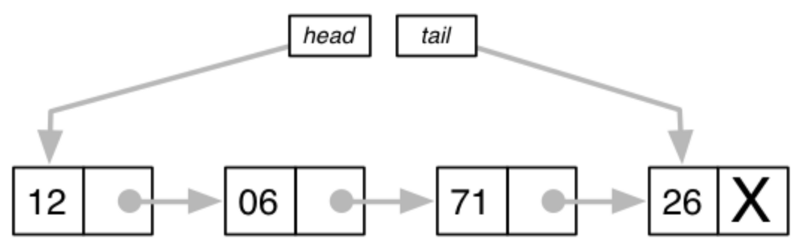
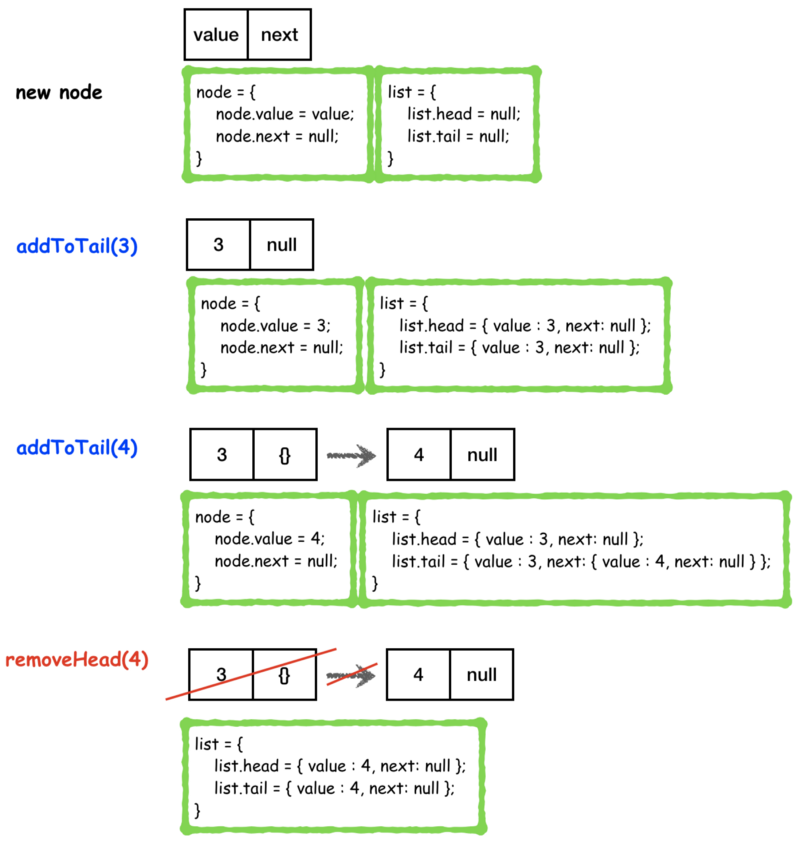
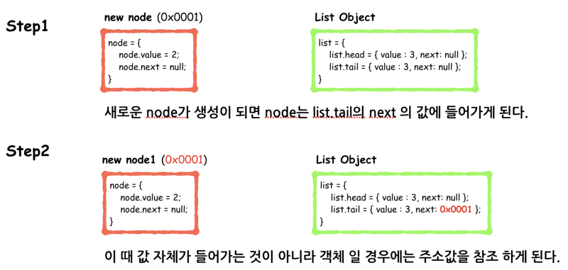
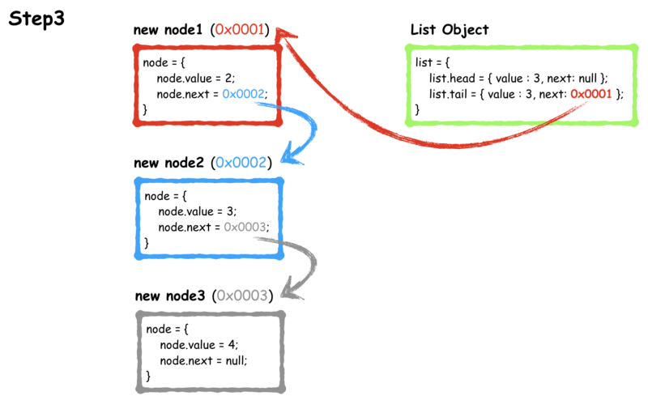
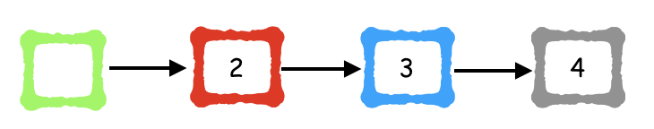

### Linked List 란 ?

> 각 노드가 데이터와 포인터를 가지고 한 줄로 연결되어 있는 방식으로 데이터를 저장하는 자료 구조이다.

Linked List

단일 링크드 리스트를 구현을 하였고, 구현을 위해 필요한 메소드는 아래와 같다.

`list` (type: object)

- head와 tail 변수를 갖고 있으며 구현된 linked list의 처음(head)과 끝(tail) 노드를 가리킨다.

`- list.head` (type: object)

- head 변수를 담고 있어 나중에 head를 제거할 때 쉽게 사용할 수 있다.

`- list.tail` (type: object)

- `addToTail()` 메소드를 사용할 때 가장 끝에 노드를 붙일 때 사용한다.
- head를 통해서 linked list의 tail에 붙이는 방법도 있지만, 이렇게 할 경우에는 노드가 추가로 붙을때 마다 head 부터 끝 노드를 찾는 번거로움(?) 이 필요해진다. (물론 complexity의 차이는 있다.)

`node` (type: object)

- `Node` 객체를 상속 받아서 `new node` 를 생성 할 때마다 해당 객체를 상속 받게 된다.

`- node.value` (type: number)

- node를 생성할때 주어진 value 값이 저장된다.

`- node.next` (type: object)

- 다음 노드를 가리키는 값이 저장되어 있으며, 없을 경우에는 `null` 이다.

`addToTail()`

- linked list의 가장 끝(tail)에 새로운 node를 추가할 때 사용할 메소드 이다.
- `list.tail`을 이용하여 구현한다.

`removeHead()`

- linked list의 가장 앞(head)를 삭제할 때 사용할 메소드 이다.
- 삭제시에 `list.head` 을 이용하여 구현 하며 삭제 전 head의 값을 `node.next` 노드로 변경 한 후 기존 head node를 삭제 해야 한다.

`contains()`

- Linked List 로 구현된 객체에서 `node.value` 가 존재 하는지 확인한다.
- `list.head` 부터 value 값이 존재하는지 확인해야 하므로 worst case의 경우에는 모든 link를 다 봐야 하는 경우가 생긴다. ( 찾고자 하는 값이 가장 끝 노드에 위치할 경우)
- 이러한 경우 때문에 Linked List의 **최악의시간복잡도 (O)**는 `**O(n)**` 이 된다.

메소드들을 구현하기 위해서는 아래와 같은 메커니즘으로 생각해 볼 수 있다.

Linked List

위의 변수들과 메소드들로 구현한 소스코드는 아래와 같다.

var LinkedList = function() {  
 var list = {};  
 list.head = null;  
 list.tail = null;

list.addToTail = function(value) {  
 let node = new Node(value);  
 if (!this.head){  
 this.head = node;  
 this.tail = node;  
 }  
 else {  
 this.tail.next = node;  
 this.tail = node;  
 }  
 return node;  
 };

list.removeHead = function() {  
 var newCurrent = this.head.next;  
 var removedValue = this.head;  
 removedValue.next = null;  
 this.head = newCurrent;  
 return removedValue.value;  
 };

list.contains = function(target) {  
 var current = this.head;  
 while ( current ){  
 if ( current.value === target ){ return true;}  
 else current = current.next;  
 }  
 return false;  
 };  
 return list;  
};

var Node = function(value) {  
 var node = {};  
 node.value = value;  
 node.next = null;

return node;  
};

위의 코드를 잘보면 `tail.next` 에 새로운 객체를 넣어서 계속 링크를 이어주는 역할을 하는데 이부분이 **call by reference** 를 하는 부분이다.

아래 처럼 링크가 생성 되었다고 보자.

list = {

    list.head = { value : 3, next: null };

list.tail = { value : 3, next: { value : 4, next: { value : 5, next: null } }  
};

};

node가 생성 될때마다 `list.next` 에 value, key가 추가로 들어가게 되는데, 눈으로 봤을 때는 저렇게 생각 할 수 있지만, **내부적으로는 주소값을 참조 하고 있는 구조 이다.**

그림을 보면서 이해하자

위처럼 주소값들을 참조하게 된다.

잊지 않기위하여 정리 ^^
