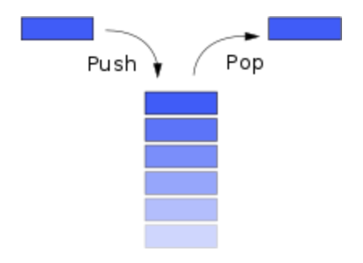
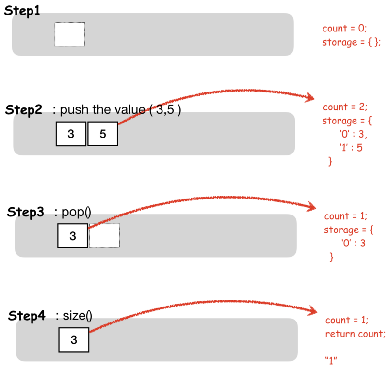
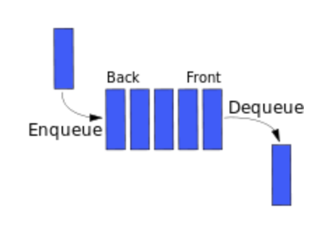
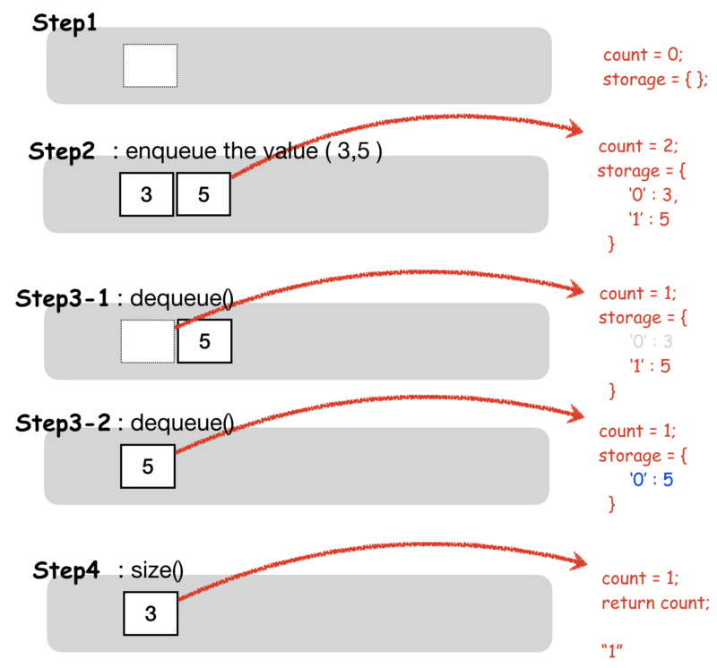

> Immersive Sprint 1 : Object-Oriented Programming

### Stack

> 자료들을 차례대로 넣고(push) 꺼낼 때는 가장 마지막에 쌓여진 자료부터 빼낸다(pop).

배열에서 array.push()와 array.pop() 메소드를 사용할 때와 동일하다고 볼 수 있다.

Stack의 구조를 “LIFO ( Last In First Out )” 후입 선출이라고도 부른다.

Stack

javascript 언어를 통해 Stack을 구현해 보자.

아래와 같은 변수와 메소드가 필요하다.

`someInstance` (type: object)

- Stack method를 담을 객체

`storage` (type: object)

- 배열을 흉내내기 위한 객체
- 0번째 index에 ‘yonghyun’을 담게되면 storage객체에는 아래와 같이 담기게 할것이다.
- storage = { 0 : ‘yonghyun’ };

`count` (type: number)

- 값을 `pop()` 할때 마지막에 `push()` 되어진 index를 알아내기 위한 변수
- size값을 알아올 때에도 `count` 값을 return 하여 얻어 낼 수 있다.

`push()`

- 데이터를 담기 위한 메소드

`pop()`

- 데이터를 빼기 위한 메소드

`size()`

- 담긴 데이터의 length를 구하기 위한 메소드

아래처럼 동작 하도록 구현을 하면 될 것 같다.

Stack

위와 같이 동작하도록 소스코드를 작성하면 아래와 같다.

var Stack = function() {  
 var someInstance = {};  
 var storage = {};  
 var count = 0;

someInstance.push = function(value) {  
 storage\[count\]=value;  
 count++;  
};

someInstance.pop = function() {  
 if ( count < 1 ){  
 return ;  
 }  
 var popedValue = storage\[count-1\];  
 delete storage\[count-1\];  
 count--;  
 return popedValue;  
};

someInstance.size = function() {  
 return count;  
};

return someInstance;

};

### Queue

> _자료를 집어 넣고 (Enqueue) 빼낼 때는 먼저 들어간 값부터 빼낸다(dequeue)._

여기서 주의해야할 점은 dequeue를 할 경우 각 배열의 index 값이 변한다는 것이다.

조금 더 쉽게 생각하면 array.shift()를 하게되면 배열의 가장 첫번째인 0번째 index의 값이 추출되게되고 array 배열의 각 index들은 하나씩 줄어들어 자리를 재배치 한다.

Queue

아래와 같은 변수와 메소드가 필요하다.

`someInstance` (type: object)

- Queue method를 담을 객체

`storage` (type: object)

- 0번째 index에 ‘yonghyun’을 담게되면 storage 객체에는 아래와 같이 담기게 할것이다.
- storage = { 0 : ‘yonghyun’ };

`count` (type: number)

- 값을 `enqueue()` 할때 가장 처음의 값을 delete 하고 count의 길이만큼 앞으로 한칸씩 땡길 때 사용
- size값을 알아올 때에도 `count` 값을 return 하여 얻어 낼 수 있다.

`enqueue()`

- 데이터를 담기 위한 메소드

`dequeue()`

- 데이터를 빼기 위한 메소드

`size()`

- 담긴 데이터의 length를 구하기 위한 메소드

아래처럼 동작 하도록 구현을 하면 될 것 같다.

Queue

위를 구현한 소스코드는 아래와 같다.

var Queue = function() {  
 var someInstance = {};

// Use an object with numeric keys to store values  
 var storage = {};  
 var count =0;

// Implement the methods below

someInstance.enqueue = function(value) {  
 storage\[count\]=value;  
 count ++;  
 };

someInstance.dequeue = function() {  
 if ( count < 1 ){  
 return ;  
 }  
 var popedValue = storage\[0\];  
 delete storage\[0\];  
 for ( var i = 1 ; i < count ; i ++){  
 storage\[i-1\] = storage\[i\];  
 }  
 delete storage\[count-1\];  
 count --;  
 return popedValue;  
 };  
 someInstance.size = function() {  
 return count;  
 };  
 return someInstance;  
};

Stack 과 Queue를 구현을 할 때 여러가지의 방법을 통해서 구현을 했다.

위의 구현 방식은 Functional 방식이며 가장 비효율적인 방식인거 같다.

#### **Instantiation pattern (인스턴스화 패턴) 은 아래와 같이 4가지 방법이 있다.**

#### Functional

- 함수는 모든 메소드를 담고 있는 객체를 갖고 있다.
- 생성자를 통해 새로운 Object를 생성 할 때 마다 해당 함수에 있는 모든 내용을 읽는다.
- 새로운 객체를 생성할 때 마다 모든 변수와 메소드 들을 읽고 저장해두어야 하므로 효율이 낮다.
- 쉽게 이해하면, **“하나의 Function에 모든 것들이 구현되어 있다”**

#### Functional-Shared

- Functional 방식보다는 적은 코드일 때에는 몰라도 코드 길이가 길어지고 새로운 Object 생성이 잦은 곳일 경우에는 Functional-Shared가 더 좋은 구현 방식이 될 수 있다.
- stack, queue를 구현할때에는 function의 return 값을 전역에 선언되어 있는 메소드 객체를 `extend()` 하여 구현하였다. (아래는 그 예이다.)
- `_.extend` 를 사용하여 객체 두개를 합쳐서 Functional과 비슷해 보이지만 Object의 경우 메모리 값만을 참조 하기 때문에 instance를 생성할 때마다 someInstance에 해당하는 메모리 값을 모두 상속 받는 Functional과는 다르다.
- 다만 Functional-Shared는 **“상속을 받아서 객체의 주소를 참조 하여 사용한다.”** 라는 것이 Functional과의 차이점이다.

var **queueMethods** = {};

queueMethods.enqueue = function(value) {  
 // enqueue  
};

queueMethods.dequeue = function() {  
 // dequeue  
};  
queueMethods.size = function() {  
 // size  
};

var Queue = function() {  
 var **instance** = {  
 count : 0,  
 storage : {}  
 };  
 **return \_.extend(instance, queueMethods);**  
};

#### Prototypal

- 위의 Functional-shared랑은 Prototypal은 차이가 크다.
- `Object.create(obj)` 를 사용하여 외부메소드를 받아 오도록 구현한다.
- 하지만 `Object.create(obj)` 는 외부 객체를 연결해 주는 역할만 한다. ( 쉽게 이해하면 가리킨다? 정도로 이해했다. )
- 그렇게 되면 외부 객체가 아무리 길어도 외부 객체를 가리키는 데이터를 저장할 공간만 있으면 되므로, 매번 새로운 객체를 생성 할 때 마다 새로운 객체는 메소드까지 모두 상속받을 필요가 없다는 것이다.
- 그렇다고 메소드를 쓰지 못하는게 아니라 해당 메소드를 사용할 때에는 상속해준 부모의 메서드를 참조 해서 접근한다.
- `object.create(obj)` 는 `obj` 를 계속 상속 받기 때문에 아주 약간의 메모리 차지는 하게된다.

var **stackMethods** = {};

stackMethods.push = function (value) {  
 // push method  
};

stackMethods.pop = function () {  
 // pop method  
};

stackMethods.size = function () {  
 // size method  
};

var Stack = function() {  
 **var instance = Object.create(stackMethods);**  
 instance.count = 0;  
 instance.storage = {};  
 return instance;  
};

#### Pseudoclassical

- Function을 생성한 후 해당 Function 의 prototype을 정의하여 접근 할수 있도록 한다.
- Pseudoclassical은 기존에 함수에 정의된 것들을 읽고 가장 나중에 prototype쪽을 읽어 들인다.
- 작성 예시는 아래를 확인하자

var Stack = function() {  
 this.count = 0;  
 this.storage = {};  
};

Stack.prototype.push = function (value) {  
 // push method  
};

Stack.prototype.pop = function () {  
 // pop method  
};

Stack.prototype.size = function () {  
 // size method  
};

이렇게 함으로써 Data Structure 의 기본 “Stack, Queue”를 4가지의 방식으로 나눠서 구현했다.
