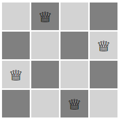
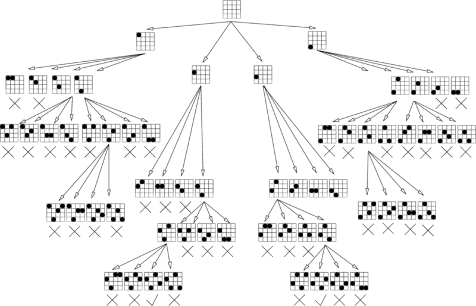

1주차에는 뭔가 데이터 구조 즉,, 이론에 입각한 수업이 많아서 이렇게 저렇게 정리를 많이 했는데, 이번엔 즉석으로 알고리즘 문제를 풀고 주어진 문제를 해결하는 방식의 Sprint가 많아서 한번에 모아서 정리를 해보려고 한다.

> Week 2 Day 1~2— Inheritance Patterns (beesbeesbees, subclass dance party, 6ees6ees6ees sprint)

> Week 2 Day 3~4 — Algorithms (n-queens sprint)

> Week 2 Day 5~6 — Browser Apps jQuery and ajax (Chatterbox client sprint)

### **Inheritance Pattern**

1주차에 각종 상속 방법에 대해서 배웠고, 해당 sprint에서는 prototype을 이용하여 상속 패턴을 배웠다.

추가로 ES6 문법 `class` 를 이용하여 상속을 이용해서도 작성을 해보았다.   
( beebeebee는 prototype을 이용하여 작석하고, 6ees6ees6ees가 ES6문법을 이용하여 작성하였다. )

글로 쓰려니 너무 거창하니.. 약간의 코드를 첨부해야겠다.

**Prototype 형태로 작성한 beebeebee**

var Grub = function() {

_this_.age = 0;

_this_.color = "pink";

_this_.food = "jelly";

};

**Grub.prototype.eat** = function() {};

var Bee = function() {

    **Grub.call(_this_);**

_this_.age = 5;

_this_.color = "yellow";

_this_.job = "keep on growing";

};

**Bee.prototype = Object.create(Grub.prototype);**

Bee.prototype.constructor = Bee;

`bee.protytpe = object.create(Grub.prototype)` 을 통해 bee의 prototype을 grub의 protytpe에 연결해 준다.

그리고 `bee.prototype.constructor = Bee;` 를 하여 bee의 prototype을 을 자기 자신을 가리키게 한다. 위처럼 하지 않게 되면 bee의 this범위가 명확하지 않다(?) 라고 하는데 prototype공부를 좀더 해서 이부분은 보충을 해야겠다.

#### ES6 문법을 이용한 class 형태 작성법

**class** Grub {

    constructor(){

_this_.age = 0;

_this_.color = "pink";

_this_.food = "jelly";

    }

    eat(){}

};

**class** Bee **extends** Grub{

    constructor(){

** _super_();**

_this_.age = 5;

_this_.color = "yellow"

_this_.job = "Keep on growing"

    }

};

protytpe을 이용한 작성법 보다 훨씬 간단하다.

`class [child] extends [parent]` 로 작성하여 상속 받을 수 있다.

super()를 통해 부모 클래스를 상속 받을 수 있다.

위 에서 `this.age` 와 `this.color` 는 `Bee` 자신의 값( 5, yellow)를 사용하게 되지만 `this.food`를 호출하였을 때에도 Bee는 해당 값을 가지고 있지 않지만 부모생성자와 연결 되어 있기 때문에 본인이 값이 없으면 부모가 값을 가지고 있는지 확인하고 있으면 그 값인 `jelly` 를 return 한다.

### Algorithm (n-queens)

1.  체스판에 퀸 ( 상하 좌우 대각선까지 모두 움직일 수 있는 ) 을 최대 개수를 놓을 수 있는 Matrix를 추출 하는 것
2.  Matrix에 퀸을 최대로 놓을 수 있는 경우의 수를 구하는 알고리즘 문제이다.

chess

위는 체스판에 퀸을 최대로 놓을수 있는(4개) 모형(?) 중에 하나이며 이러한 것들이 최대 n\*n Matrix에서 몇개까지 만들 수 있는지를 풀어야 한다.

먼저 위의 문제를 푸려면 백트렉킹을 통해 풀어야 한다. 해당 내용은 문제를 풀고 난 뒤 관련 내용으로 인터넷 검색을 하여 약간의 정보를 취득했다.

백트래킹이란?

특정 노드에서 유망성(promising)을 점검하고, 유망하지 않다면 그 노드의 부모로 돌아가서(Backtracking) 다음 노드에 대한 검색을 계속하게 되는 절차입니다. 아래그림과 같이

어떻게 구현해야될 지는 알겠지만, 실제로 하지는 못했다.

나중에 꼭 해봐야겠다.
