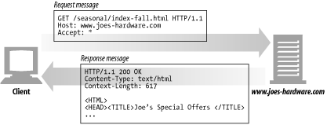
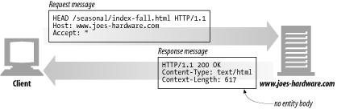
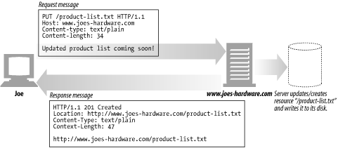
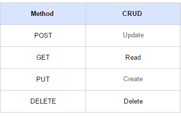
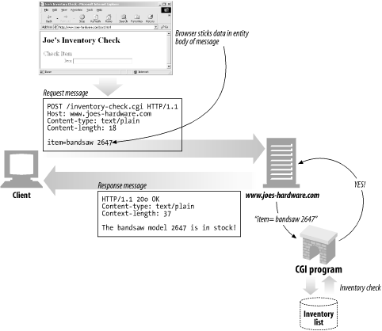
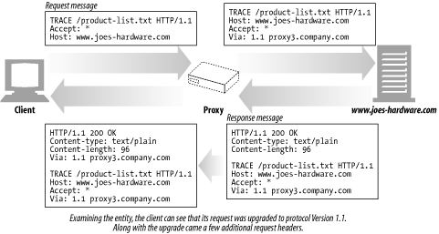
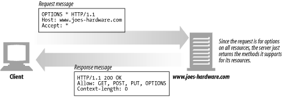
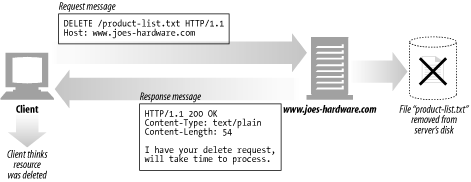
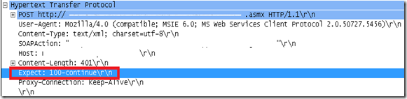
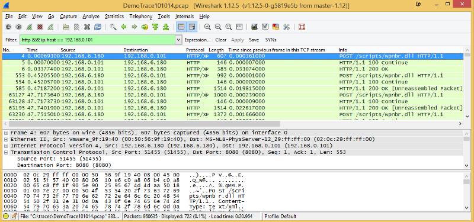

음.. 개발자가 되어서 이런걸 정리하게 될줄은 사실 몰랐다.

난 네트워크 엔지니어 출신이고 당연히 TCP 와 HTTP 프로토콜은 향후 몇년간 안해도 기억은 나겠지 했지만, 6개월만에 거의포맷 되었다.

Evernote에 정리해둔 HTTP Method와 각종 Status Code를 보는데 기억이 잘 안난다…ㅠㅠ

그래서 기억도 되살릴겸 다시 정리를 해보려고 한다.

### **Method**

#### **GET**

서버에게 Resource를 보내도록 요청하는데 사용 (**서버의 Resource를 읽음**)

GET example

#### **HEAD**

GET과 동일하지만 **서버에서 Body를 Return 하지 않음**

- Resource를 받지 않고 오직 찾기만 원할때
- object가 존재할 경우 응답의 상태 코드를 확인할때
- 서버의 응답 헤더를 봄으로써 Resource가 수정 되었는지 확인

HEAD example

#### PUT

**서버에 문서를 쓸때 사용** (GET과 반대)

- PUT 메소드는 서버가 **Client 요청의 Body를 확인**한다.
- 요청된 URL에 정의된 새로운 Resource를 생성하기 위함
- 요청된 URL이 존재할 경우 대체하여 사용

PUT example

#### POST

**Server에 Input Data를 보내기 위함** (HTML form에 많이 사용)

- PUT vs. POST

— PUT은 서버의 Resource에 Data를 저장하기 위한 용도

— POST는 서버에 DATA를 보내기 위한 용도

Method usage
POST example

#### **TRACE**

Client로 부터 Request Packet이 방화벽, Proxy Server, Gateway등을 거치면서 packet의 변조가 일어날 수 있는데, 이 때 **Server에 도달 했을 때의 최종 Packet의 Request Packet을 볼수 있다**.

- 즉, **Original Data와 서버에 도달했을 때의 비교본 Data를 서버의 응답 Body를 통해 확인 할 수 있다.**
- 요청의 최종 수신자는 반드시 **송신자에게 200(OK) 응답의 내용(Body)로 수신한 메세지를 반송**해야 한다.
- **최초 Client의 요청에는 Body가 포함될수 없다.**

TRACE example

#### **OPTION**

- Target Server의 지원 가능한 method*(ex> GET, POST …)*를 알아보기 위함

OPTION example

#### **DELETE**

- **요청 Resource를 삭제**하도록 요청
- 그러나!! HTTP 규격에는 Client의 요청에도 서버가 무효화 시킬수 있도록 정의되어 있음
- DELETE Method는 항상 보장되지 않는다.

DELETE example

_이 부분은 공부하면서 추가하는방향으로 (경우의 수가 워낙 많으니..)_

### **Status Code**

#### 1xx (정보제공)

- 100 continue

1.  HTTP 1.1 에서 제공
2.  Expect 헤더가 전송되어지면 초기 요청내의 폼 데이터(body)는 전송되지 않는다.
3.  웹서버가 해당 응답을 할수 있도록 구현 했다면 100 continue로 응답하지만, 모든 웹서버가 그런것은 아니다.

100-continue packet header

- Client의 100 continue 요청
- HTTP Client Application에서 서버에 Entiti Body를 보내기 전에 해당 Body를 받을 수 있는지 서버에 check 해볼 때 사용  
  (Large body가 서버가 수용할 수 있는지를 확인하고 수용할수 없을 경우 피함으로서 Client가 미리 판단을 할 수 있음)

— Server의 100 continue 응답

— 200 OK 로 100 continue에 대한 Response를 보내주거나, error code로 응답한다.

— 서버는 100 continue에 대한 entity body를 받을 경우에 Client에게 해당 응답을 한다.

— 서버가 Client에게 100 continue에 대한 Header가 아닌 entity body를 받을 경우에는 100 continue에 대응하는 status code(ex> 200OK)는 보내지 않는다. (Client는 이미 데이터를 보내기로 결정 하였기 때문에)

- Proxy와 100 continue

— client -> proxy 로 100 continue 요청이 올경우 아래 두가지로 동작한다.

1.  next hop이 http 1.1을 호환하거나 net hop의 호환 버전을 모를경우 100 continue 패킷을 forwording 한다.
2.  next hop이 http 1.1 아래버전이 호환될 경우 417 Expectation Failed Error 발생 (417: 서버가 “Expect: “ 요청 헤더의 value를 만족할 수 없다. ex>100-continue)

#### 2xx (성공)

#### 3xx (리다이렉션)

#### 4xx (클라이언트요청오류)

- 403 Forbidden 해당 접근이 거부되었을때

— 허용되지 않은 메소드가 있을 때 _(GET POST 만 허용해뒀는데 TRACE와 같이 허용되지 않은 메소드로 요청했을 경우)_

— ID/PASSWD로 인증이 실패하였을때

- 406 Not Acceptable 허용불가능

— 서버에서 ACL 걸었을 때

#### 5xx (서버응답오류)

- 500 Interner Server Error 내부 서버 오류

— Apache <-> PHP <-> MySQL 간 데이터를 주고 받을 때, 내부적으로 Error가 발생될 경우 해당 응답코드 발생

— 일반적으로 SQL에서 문제가 발생됨

— Blind SQL 공격: 스키마의 종류를 알아낸다. 예를 들면 필드가 int인지 char인지를 확인 할 수 있다.

— a=1 을 넣어 integer 필드 인지 char 필드인지 확인 할 수 있다.

— 하나의 IP로 여러번 접속 했을 경우~ 웹방화벽 접근 로그를 통해 확인해 볼수 있다.

- 503 Service Unavailable : 서비스 불가능

— 일반적으로 Proxy장비에서 서버에 서비스가 불가능할 때 띄어준다.
