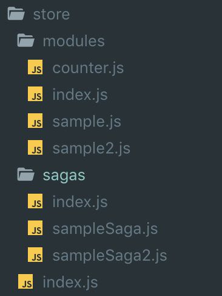
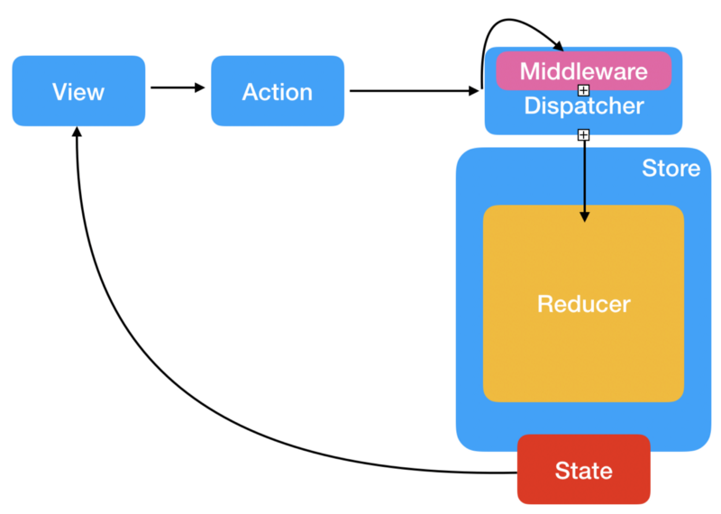

from redux-saga homepage

현재 나는 거래소 플렛폼에서 React를 사용하여 개발 및 유지 보수를 하고 있다. 기존기술 스택중엔 React / Redux가 포함 되어 있었고, 리덕스 미들웨어로는 Redux-Thunk를 사용하여 비동기 처리를 수행하곤 했다.

입사 하였을 때에는 Redux 설정이 모두 되어 있었고, Action Type에 대한 정의, 미들웨어 채택 등 이미 되어있었다. 자연스럽게 Redux는 Thunk와 함께 이해를 하게 되었고, 꽤나 익숙해질쯤 새로운 프로젝트를 시작하게 되었다.

> Redux-Thunk를 사용하면서 불편했던 점

1.  가독성이 너무 안좋다.  
    \- Action이 실행되는 함수에서 dispatch를 통해 redux 상태 변화(Request, Success, Failure와 같은)를 함께 표기하다보니, 한 함수마다 보기 불편한 코드가 존재한다.
2.  React Components 안에 Promise가 존재하여 코드가 난잡해보인다.
3.  이건 내생각인데 진짜 Flux 패턴과 비슷하게 비교해서 봐도 잘 이해가 안됐다.

> Redux-Saga 선택이유

1.  코드의 깔끔함  
    \- Generator의 미숙에도 saga를 고른 이유는 thunk를 쓸때 promise 를 사용하다가 async / await를 사용할때 코드가 정말 깔끔해진다라는 느낌이 들었는데, Saga가 딱 그런느낌이 었다.
2.  이건 스터디하다 알게 된건데, saga는 action에 반응을 한다. take와 같은 effect를 이용하여 action을 가지고 반응할 수 있다.
3.  하나의 함수에서 여러개의 동작을 체인 형태로 실행 시키더라도 코드 자체가 굉장히 간결하다.
4.  진짜이유는.. 써보고싶어서..

### 디렉토리 구조

Redux-thunk를 사용하다가 saga를 사용하는데 있어 가장 오래 검색해본것 중에 하나가 디렉토리 구조를 잘 정의하고 사용하고 싶었으나, 뭔가 best practice 와 같은것은 찾지 못하였다.

생각보다 잘 정리된 디렉토리 구조는 없고, 사람마다 자기회사에 적합한 디렉토리 구조를 가져간다고 생각해서 나도 그냥 나 편한대로 구성해보았다.

Redux-saga directory structure

1.  store 디렉토리는 src 디텍토리의 하위 디렉토리이다. (src/store)  
    \- (난 참고로 서브모듈에 데이터를 저장하여 사용중이다.)
2.  reducers directory  
    \- index.js 파일을 통해 각 reducer들을 export 한다. (나중에 store index.js파일에서 combineReducer를 수행한다.)  
    \- 각 reducer(sample.js..) 파일에는 action, actionType, reducer를 함께 담는다. (이렇게 모두 담아서 사용하는 패턴을 duck 패턴이라고 하는데, 그래서 디렉토리명을 modules로 결정했다.)
3.  sagas directory  
    \- index.js는 rootSagas를 담고 있고 rootSagas는 yield all(\[…\])을 통해 각 watcher들을 담고 있다.  
    \- sampleSaga와 같이 각종 saga 파일들은 비지니스 로직을 설계한다.
4.  마지막으로 가장 상위 index.js는 reducer를 통합하고, devTools를 합쳐서 store를 생성하여 export 한다.

### **코드 로직 샘플**

기존 Redux구조를 조금더 알기쉽게 표현해 봤다.

1.  View에서 Client 혹은 어떠한 행위에 의해서 Action이 실행된다.
2.  Action은 Middleware(Saga)에서 ActionType을 기준으로 catch 한다.
3.  비동기 동작 혹은 단순 변환 작업이 이뤄지고 Dispatch 된다. (saga에서는 put으로 동작한다.)
4.  dispatch를 통해 Reducer에서 action type을 기준으로 순수함수로 리턴한다.
5.  state에 반영이 되고, View에 반영이 된다.

> 실제 코드

**home.jsx**

styled-component를 사용해서 못알아볼수 있지만.. 다른건 별로 없기에 패스하고, 가장 크게 다른점은 가장 아래에 onRequestSample 이라는 dispatch 함수를 봐야한다.

action type으로 action을 시도하고 있다.

코드로직 샘플에 대한 동작방식은 아래와 같다.

1.  액션을 type으로 시도하게되면 (물론 type과 같이 추가적인 key를 전달하여 액션 함수를 핸들링할수 있다.)
2.  dispatch를 통해 action이 전달될때 reducer로 가기전 saga가 interceptor를 한다.
3.  해당되는 saga logic을 태우고, (비동기 통신등.) 작업이 완료되면 reducer에서 상태값 변경을 한다.
4.  이후 store에 반영이 된다.
5.  view에도 반영이 된다.

더 잘 기록하고 싶었는데, 시간상 생각나는것들만 나열해서 적어보았다.
