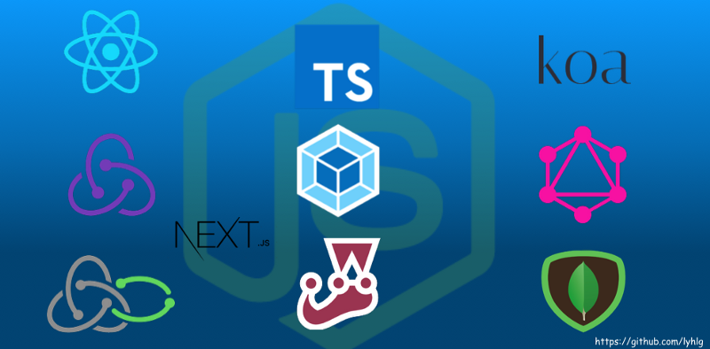
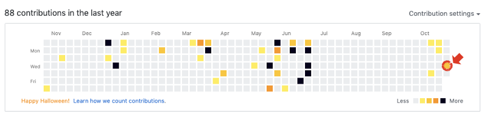

오늘 부터 github에 매일 commit 을 남길수 있도록 해보려고 한다.

> 목표

1.  기술적으로 specup을 하고 싶은 부분에 대해서 개발 초기 셋팅 부터 기획그리고 개발 project를 진행해보려고 한다.
2.  Frontend와 backend를 모두 구성하여 개발을 진행한다.
3.  추후에는 RN을 통해서 해당 앱을 구동해 보는것 까지가 목표다.
4.  **Frontend Stack**

- React / React-Router
- Redux / Redux-saga
- Babel
- Axios / Axios-interceptor
- GraphQL + Restful API

**4\. Backend Stack**

- Node.js
- Koa
- MongoDB + Mongoose
- GraphQL + Restful API

5\. SSR

- NextJS

6\. 공통

- Typescript
- Jest / Enzyme
- Eslint / Prettier
- Webpack

(2019.11.16 ~ 2019.12.01 까지는 개인적인 일정이 있어서 진행을 못할것같다.)

진행상황

**FRONTEND 부터 개발진행**

1.  Webpack, Babel, Typescript 설정 완료
2.  Directory archiecture 완료
3.  Eslint 및 prettier 셋팅 완료

참고

**RDBMS vs. NoSQL**

1.  비 관계형 DB + Node.js 서버 사용과 관련된 몇 가지 잠재적 인 문제가 존재한다.
2.  아래와 같은 문제가 존재하기도 하고, 사실상 편하게 가벼운 프로젝트를 진행하려고 하는데 더 어렵고 지치는 길이 될까봐 이건 백앤드 구성을 할때 다시 생각해 보려고 한다.
3.  아마도 MongoDB + mongoose (sequelize) 조합으로 가지 않을까..

(a) the joins are slower and responses are slower, because Node is not C/C++  
 -> Node가 C / C ++가 아니기 때문에 조인과 응답이 느립니다.

(b) the expensive joins block your event loop, because the join is happening in your Node.js code not on some database server  
 -> join은 데이터 베이스 서버가 아닌 Node.js code에서 일어나기 때문에, 값 비싼 조인은 event loop를 블락한다.

(c) manually writing joins is often difficult and error-prone; your noSQL queries could easily be incorrect or your join code might be incorrect or suboptimal; optimized joins have been done before by the masters of RDBMs, and joins in RDBMs are proven to be correct, mathematically in most cases.  
 -> 수동적으로 조인을 작성하는것은 종종 어렵고 오류를 발생시킨다.  
 -> noSQL 쿼리가 쉽게 부정확하거나 조인 코드가 부정확하거나 차선책(?) 일 수 있습니다.  
 -> 최적화 된 조인은 RDBM의 마스터에 의해 이전에 수행되었으며, RDBM의 조인은 대부분 수학적으로 정확하다는 것이 입증되었습니다. (정확성을 가지고 있다.)

(d) Some non-relational databases, like MongoDB, _do not_ support transactions - in my team's case, that means we have to use an external distributed lock so that multiple queries can be grouped together into an atomic transaction. It would be somewhat easier if we could just use transactions and avoid application level locks.  
 -> MongoDB와 같은 일부 비 관계형 데이터베이스는 트랜잭션을 지원하지 않는다.  
 -> 여러 쿼리를 원자 transaction으로 그룹화 할 수 있도록 외부 분산 잠금(?)을 사용해야한다.  
 -> 트랜잭션을 사용하고 애플리케이션 레벨 잠금을 피할 수 있다면 쉬울 것이다.

\+ 대부분의 관계형 데이터베이스는 트랜잭션에 상태 저장 연결(stateful)을 사용하므로 비동기 비 블록 i/o의 주요 이점을 최소화한다.
