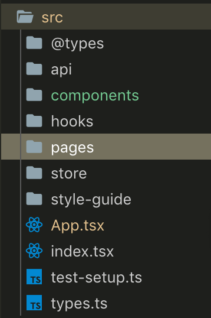

현재까지 React Project를 3개 가량 진행해왔고, 그중에 최근프로젝트는 zero configuration에서 시작하여 모든 설정 파일을 작성해왔습니다.

Webpack설정, Lint 설정, React-Redux-ReduxSaga 패턴 등 여러 설정을 진행 하였습니다.

그중에서도 이번에는 Frontend의 기본적인 디자인 패턴인 Container Presentational패턴에 대해서 적용한 방법과 예시를 들어보려고 합니다.

저는 Redux를 사용하였고, 결론 부터 말씀드리면 아래와 같이 데이터 플로우를 구성하였습니다.

> **Container Component 이하 CC / Presentational Component 이하 FC**

1.  모든 Data는 Redux Store에 저장한다.
2.  CC에 해당 하는 Main Component들은 가장 상단에서 FC를 랜더링 한다.
3.  FC는 각자 View에 필요한 상태를 제어 하기위한 State를 가질 수 있다.
4.  가능한 FC는 Funtional Component로 작성을 한다.

(+ 나중에 개발을 완료하고 알게된 사실인데 hook을 조금 더 효율적으로 써볼걸 그랬다. ㅠㅠ)

### Container / Presentational

- Frontend의 기본적인 디자인 패턴으로 설명한 내용은 기존에 포스팅에 있어서 링크로 대체합니다.

[**\[React\] Container, Presentational**  
\_Frontend 개발자로 취업하고 업무를 시작한지 일주일이 지났다.\_medium.com](https://medium.com/@lyhlg0201/react-container-presentational-1bbc701b7fd4 'https://medium.com/@lyhlg0201/react-container-presentational-1bbc701b7fd4')

### 디자인 패턴 구조 상세

#### Container Component

1.  Redux action dispatch를 담당한다.
2.  dispatch에는 Ajax call이 될수 있고, store update가 될 수 있다.
3.  Redux에 선언된 Action들을 import받고 dispatch 함수를 반환 하여 CC의 props로 내려준다.

#### **Presentational Component**

1.  Redux와 Connect 하지는 않고 모두 CC로 부터 props를 받아 처리한다.
2.  FC도 처리해야하는 View state가 많거나, 자체적으로 React-Router (Sub Header)가 필요한 경우 규모가 커지는 경우가 있다.
3.  정확하게 FC는 View 용도로만 사용을 한다.

### 파일 구조 상세

Bussiness 로직에 따른 파일 구조를 채택하였다.

먼저 고려사항은 아래와 같다.

1.  CC에 해당하는 컴포넌트들은 `src/pages/` 안에 담에서 관리합니다.

file 구조

2\. App.tsx 파일은 react-router를 구성하고 있고 `src/pages` 안에는 Route되었을때 최상단 Container들이 위치하고 있습니다.

3\. 그리고 같은 레벨에 포함되는 `src/components`에서는 Container를 구성하고 있는 FC들로 구성되어 있으며, `src/components/hom/e` 과 같이 Container와 동일한 파일이름으로 디렉토리를 구성합니다. (이유는 규모가 커지다보면 FC도 굉장히 커져서 여러개의 View Component로 구분해야되는 경우가 생기더라구요.)

### 하면서 느낀점

1.  확실히 어디서 어떤작업을 해야 명확한지 알 수 있다. (로직을 다루는 곳 Viewing을 하는곳..)
2.  Redux store에 너무 많은 데이터가 축적 될 수도있다.
3.  프로젝트를 할 때에는 prop-types를 사용하였는데, 너무많은 데이터가 축적되면 prop-types를 선언하는 작업이 너무 시간 소모적이다.
4.  정말 react life cycle이 정교하게 필요한 경우가 아니면 React-hook, Redux-hook을 이용하여 가독성 좋은(?) 코드를 작성해보고싶다.
