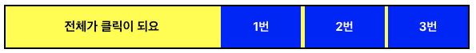
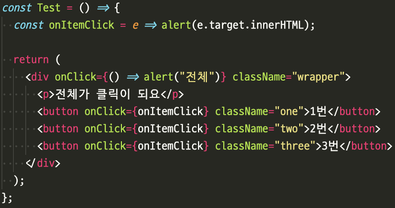
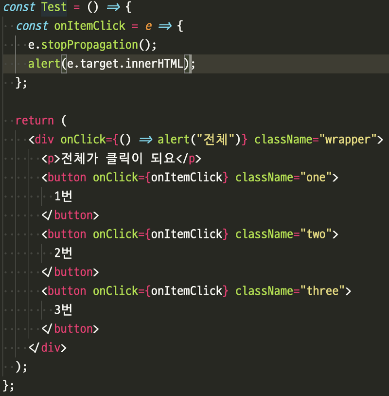

javascript event (캡처링, 버블링)

](img/1__DGinZ3yza__ZZBrhffBLjRQ.png)
출처: [https://javascript.info/bubbling-and-capturing](https://javascript.info/bubbling-and-capturing)

javascript 이벤트 캡처링과 버블링에 대해서는 어느정도 인식 하고 있는 상태긴 하였지만, 실제로 실무에서 코딩을 하다보면 급하게 처리되는 경우가 허다했다. 요즘엔 아에 습관이 되버린거 같아서 다시 리마인드(?)겸 학습을 해보려고 한다.

먼저 HTML DOM API에서 이벤트 전파의 두 가지 방법인 이벤트 캡쳐링과 버블링을 이해해야 한다.

#### Capturing

위의 사진에서 보다시피 *Capture Phase(1)*에 해당 하는 부분이 Capturing 인데, 캡쳐링은 이벤트가 가장 바깥 쪽 요소 부터 캡처되고 안쪽 요소로 (즉, *Target Phase(2)*까지) 전파가 된다.

#### Bubbling

반대로 Bubbling은 *Bubbling Phase(2)*은 가장 안쪽 요소 *(*즉, _target Phase(2))_ 부터 캡처 처리가 된다음 외부 요소로 전파가 되는 것을 말한다.

DOM의 기본적인 동작은 bubbling방식이다.

TargetNode(예를 들자면 버튼클릭)에 이벤트가 발생이 되게 되면, 기본적으로 window 객체에서 부터 target node까지 capturing이 이뤄지고, targetNode로 부터 bubbling이 이루어지면서 event를 실행시킨다.

하지만 우리가 capturing 방식으로 변경하고 싶다면 아래와 같이 사용해서 변경 할 수 있다.

#### 기본 자바스크립트 환경

**button.addEventListener(‘click’, onItemClick);** // default : bubbling 환경

**button.addEventListener(‘click’, onItemClick, true);** // optional : Capturing 환경

#### React 환경

**<button onClick={onItemClick} />** // default : bubbling 환경

**<button onClickCapture={onItemClick} />** // optional : Capturing 환경

나는 React 환경에서 개발을 진행하고 있기 때문에, 다음과 같은 테스트 코드를 작성하고 개발을 진행해 보았다.

내가 진행하는 프로젝트에서는 List 형태를 보여주는 화면이 많고 리스트 안에 여러 다른 이벤트들이 발생하는 구조이다. 간단하게 그림으로 표현하면 아래와 같다.

간단하게 설명을 하면 ‘_전체가 클릭이 되요_' (background: yellow) 영역이 있고, 각각 1번, 2번, 3번(background: blue) 버튼이 존재한다.

이때 React Code는 아래와 같다.

위와 같은 코드 상태에서 1번을 누르게 되면 1번에 대한 이벤트 alert이 발생되고, bubbling 되면서 상위 div의 onClick 이벤트가 발생되면서 alert으로 ‘전체'가 한번 더 호출된다.

해결을 하려면 아래처럼 stopPropagation을 event에 등록하면 더이상 capturing 또는 bubbling을 전파하지 않는다.

> **만약에 button 태그들이 버튼이 아니라 그냥 div 위에 놓여진 모형인데 그 모형을 클릭해도 상위 div의 event를 발생 시키고자 한다면 어떻게 해야할까?**

쉽게말하면 button을 눌러도 alert이 발생되면 ‘전체' 라고 뜨게 하는것이다.

#### CSS를 이용한 제어

button에 point-event: none; 을 줘서 css로 제어할 수 있다. 이렇게 하게되면 button에 존재하는 event는 실행되지 않게된다.

#### **Capturing을 이용하여 부모부터 실행 될수 있도록 제어**

onClick 이벤트들을 모두 **onClickCapture**로 변경 하고 e.stopPropagation()을 유지시켜주면 된다.

어떤게 더 좋고 어떤게 더 훌륭한 방법인지는 차차 알아가야 겠지만, 이렇게 javascript를 조금더 잘 활용하는 방법, HTML DOM에 대해서 잘 알아가고 있다 라는 생각이 드는건 좋다. 좀 더 javascript를 잘하는 개발자가 되고싶다.
