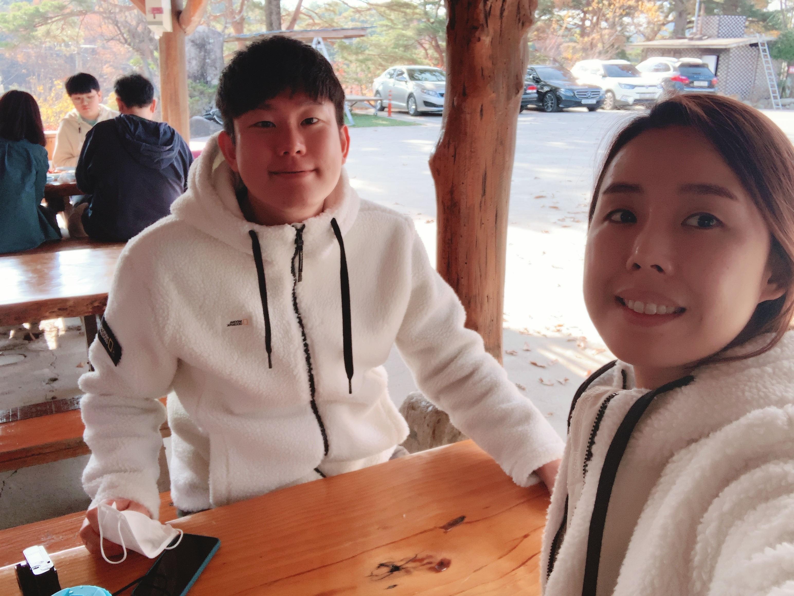
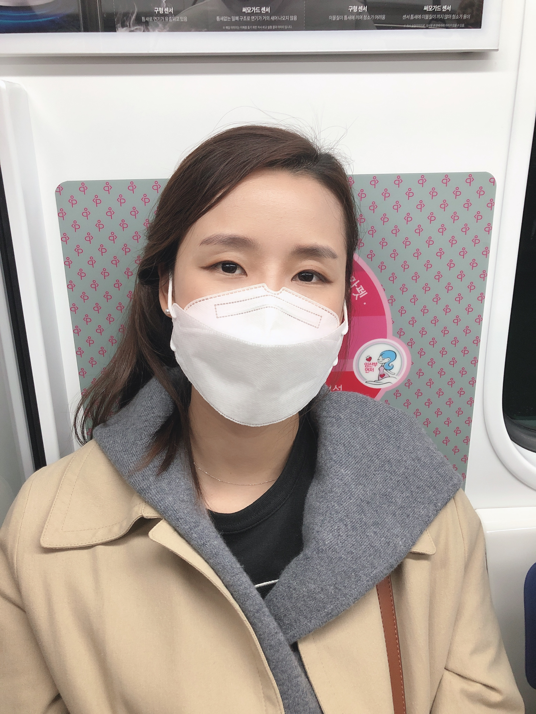
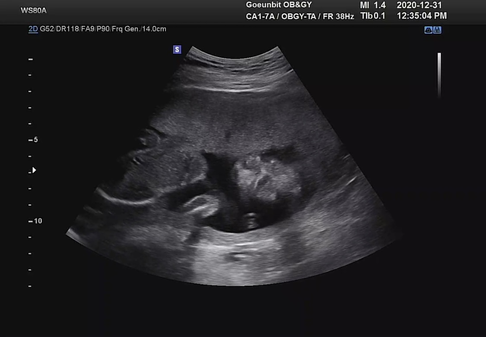
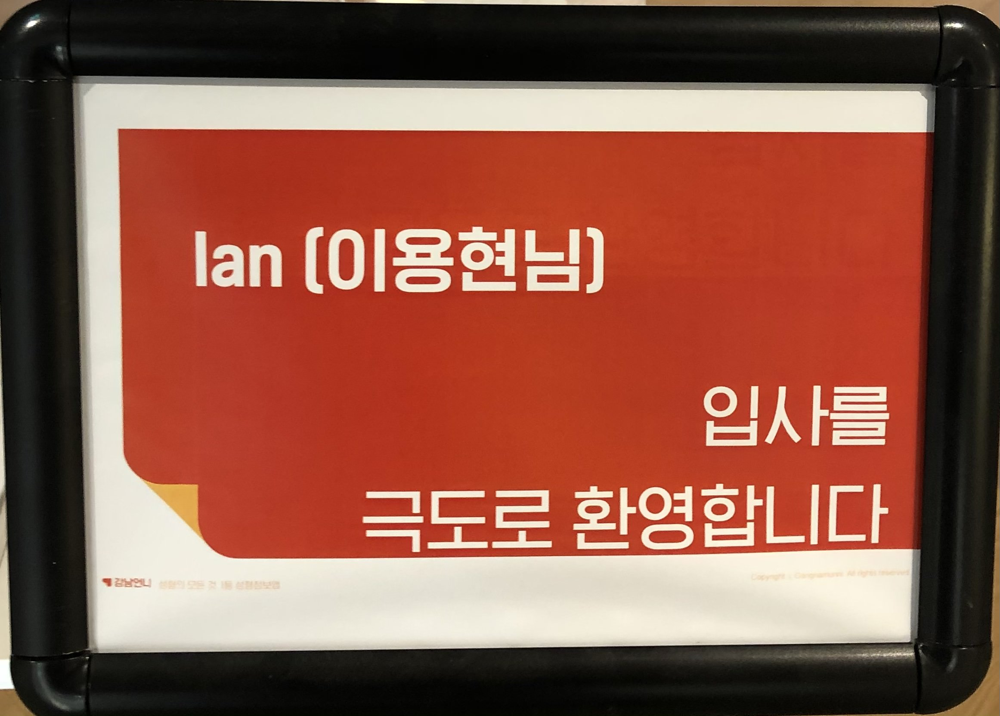

2021년이 되면서 2020년 회고를 작성해 보려고 한다. 2020년은 정말 많은 이슈를 만들기 어려웠던 해(코로나의 해) 였음에도 불구하고 기억남는 굵직한 것들이 있는 것 같다.

## 에어프레미아 입사 그리고 퇴사

  
   

2020초에 새로운 마음으로 에어프레미아(항공사)에 이직을 결심 했다.  
흥미가 있는 도메인이었고 나름 여러가지로 지원하기전 부터 목표와 기대가 있었다. 
첫째는 내가 항공사 시스템을 처음부터 도입한 사람이 되어보는것, 둘째는 이러한 항공 산업에서 혹은 비슷한 업종에 계신 분들이 사용할 수 있는 기능들을 개발해서 오픈 소스화 해보는것 그리고 셋째는 여행을 조금싸게 가고싶다.. 등이 있었다. 첫째와 둘째는 가능할 수 있었을 것 같았다. 에어프레미아 첫 프런트엔드 개발자로서 완전 초기 셋업부터 개발을 하였고 그간의 노하우를 녹여볼수 있는 절호의 기회였다. 그리고 Airbnb component처럼 컴포넌트 라이브러리화를 해서 배포해보고 싶어서 진행을 지속적으로 해왔지만 이 부분도 결국엔 하지 못했다.  
모든 것은 코로나가 와서 여행업이 모두 힘들어졌고, 우리도 고객을 받을 수 없는 상태가 되었기 때문이다. 결국에는 에어프레미아에 계신 모든 개발자 분들은 떠나게 되었고 나도 새로운 회사를 찾아 떠났다.  
모든 것에는 운과 타이밍이 따라줘야 하는 것 같다. 내가 에어프레미아를 퇴사하게된건 그 누구의 잘못도 아니다. 2020년 1월부터 계속 되었던 코로나 그것이 지속적으로 힘든 상황으로 놓이게 만든 것 같다.  
좋은 사람들과 헤어지는건 아쉬운 일이지만 현실을 잘 마주하는 것도 중요하다고 생각한다.  
우리 에어프레미안들이 좋은 곳을 찾아 행복한 2021년이 되길 바란다. 🙏

자세한 내용은 [에어프레미아를 퇴사하면서](/retrospective/airpremia%20회고/)에 기록했다.

## 혼인신고

 
지금은 이 때 우리가 혼인 신고를 한 것을 후회하고 있지만(~~망할 부동산 정책 때문에~~)..
2월 21일날 영등포에서 혼인 신고를 완료 하였다. 우리는 결혼을 하고 진짜 부부가 되었다.  
혼인 신고를 하고 앞 뒤로 변한 것은 없지만, 보이지 않는 더 끈끈한 선으로 연결된 기분이다.  
사랑하는 사람이 생긴다면, 결혼은 필수다! (추천) ㅋㅋㅋ

## 그리고 임신

 

태명: **수박이** / 이유: 아내가 수박을 좋아함 (~~수박 4-5통은 먹은듯 이번여름에~~)  
올해 혹은 내년 어찌됐던 우리는 아이 계획은 가지고 있었다. 감사하게도 아내의 회사가 어린이집을 운영하고 있는 곳으로 이직을 하게 되었고, 아이를 준비하게 되었다. (아직 젊음.)  
9월말 경에 아이를 확인하고 현재는 벌써 20주차의 거대한 아이로 성장 중이다. 이제는 슬슬배도 나온다. 20주차 까지에도 임산부들이 겪는 여러가지를 다 경험해 볼 수 있다. 입덧은 초반엔 좀 했는데, 요즘엔 안하는 것 같고 전보단 조금더 많이 먹는것 같다. 다행이 술과 카페인이 임신 후에 안땡긴다고 하는 멋진 아내!!🤰  
아내가 수박이를 잘 품고 내년에 세상에 나올 수 있도록 좋은 남편 역할을 잘 하는 것이 내년의 가장 중요한 목표!  
건강히만 나와주세요.🍉 우리가족 사랑해
 

## 개발자로서 부수입 올리기
나도 개발자가 된다면, 회사일 말고도 나의 일 혹은 다른 사람의 외주업 같은걸 해볼 수 있지 않을까? 라고 생각했었다. 특히 가까운 사람이라면 보수 없이 해주고 서로 기쁠 수 있는 일이 될 수 있으니까 말이다. 그래서 2020년에는 그런 기회가 있다면 놓치지 않으려고 했다.  
그렇게 해서 하게 된 외주 업이 있었다. 어렵진 않았지만, 그래도 신경이 꽤 쓰이는 두개의 프로젝트를 진행했다. 진행기간은 그렇게 길지 않았지만 코로나로 계속 오픈이 늦어져서 만든 시간보다 QA하고 납품 하는 시간이 더 길었던것 같다. 크게는 두 개를 했지만 세부 프로젝트로는 4개 정도 한 것 같다. 하는 동안에는 주말도 없고 가끔은 퇴근 후에도 진행을 했던 것 같다.  
키오스크 업무여서 키오스크스럽게 하는 것들에 대해서 고민을 좀 했던 것 같다. 내년엔 못하지 않을까 싶다. 더 할일들이 너무 많아서 말이다. 그래도 좋은 경험 이었다.

## 부자가 되기 위한 작은 경험
나와 내 아내의 진짜 목표는 고액 연봉자가 되는 것이 아니다. 부자가 되는 것이다. 마음의 부자, 그리고 진짜 돈 많은 부자가 되는 것이 목표이다. 우리는 결혼 하고도 이 목표를 이루기 위해서 이것 저것 경험하고 있다.  
올해에는 부동산 경매를 돈을 지불하고 공부했고, 임장(서울 곳곳과 지방도 다녀왔다)을 직접 다니며 실제 어떤 부동산들이 비싸지고 왜 비싼 가격에 거래가 되는지 확인 할 수 있었던것 같다. 가장 기억에 남는 책은 부자아빠 가난한 아빠를 읽으면서 부자는 어떤식의 생각을 가져야 하고 자산에 대한 개념을 알게 되었다. 내년에는 더 많은 책을 읽고 느낄 수 있어야 될 것 같다.  
적은 돈이지만 미국 주식에도 투자 하고 있다.  
개인적으로는 아내도 개발자니까 주말에 조금씩 시간을 내여서 서로가 생각하는 좋은 아이디어에 대해 공유하고 기획한다. 그리고 디자인하고 개발하여 세상에 내보는 사이클을 돌려보려고 한다. 곧 좋은 아이템이 세상에 나오는 것을 준비하고 있다. (우리는 세상 사람들이 우리 프로그램을 사용함으로 이로워 지길 바란다. 아직은 수익 구조는 생각하지 않는다.)  
부자가 되는 길은 장기전으로 보고 있고 그 루트는 여러개로 열고 있다. 

## 힐링페이퍼 입사 

2020년 말에 나는 힐링페이퍼(강남언니)에 입사했다. 코로나 때문에 회사 동료들과 많이 가까워질 수 있는 시간은 없지만, 나름 적응을 잘 하고 있다. 이런 말을 들어 본 적은 있다. 성공할 것 같은 회사에 가면 구성원은 느낄 수 있다고 한다.  
난 나는 그런 경험을 해본적은 없지만 이번 회사는 확실히 느껴지고 내가 입사하고 싶어서 바라본 회사에 아주 많이 근접하다. 관련해서는 3개월이 지나고 회고글을 따로 작성해볼까 한다. 아직은 경험이 너무 적다.

## 2020년의 나는
><u>**나의 성장, 미래의 성공을 위한 손질 그리고 소중한 생명의 탄생의 해**</u>  

2번이나 올해에는 이직을 하고 왜 올해에 이직을 하는지에 대한 답변은 10번도 넘게 한것 같다. 2019년 말에 그리고 2020년 말에 나는 두번의 시점의 면접관들을 만나왔다. 2019년 말 보다 2020년 말에 더 많은 곳에서 내가한 업무를 인정하고 내가 가지고 있는 철학에 공감해주셨고 좋은 면접 경험을 할 수 있었다. 2019년에 부족했던 내가 2020년엔 꽤 많이 성장하여 3년차 개발자로서 더 자신감 넘치게 되는 한해가 아니였나 싶다.  
그리고 부자가 무엇인가, 부자가 되기 위해선 내가 무엇을 해야 하는 가에 대해서 내가 생각할 수 있는 범위를 늘릴 수 있었던 계기가 되었던것 같다.  
마지막으론 올해 절반이 지나간 20주 수박이가 건강하게 잘 자라고 있으니, 지금처럼만 잘 자라서 내년에 만났으면 좋겠다. 내가 아빠가 된다니 ^^..  
시간이 훅 지나갔다고 생각하는 2020년에 정말 많은 일들이 일어났다. 그리고 이 변화들은 되돌아 보지 않으면 알 수 없다. 내 변화를 돌이켜보면서 반성하고 칭찬하며 차근차근 성장하는 것이 좋은 어른으로 간다고 난 믿고 있다.  

---
ps. 내년엔.. 배달음식을 줄이고 운동을 좀 해야겠다..  그리고 집안일을 더 신경쓰기!!
