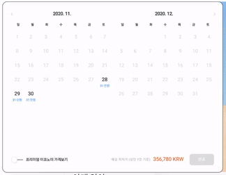
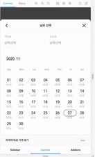

# Why Airpremia

당시 내가 다니던 회사가 무너져 가고 있었다. 당시 결혼식을 막 올리고 신혼 여행을 다녀왔을 무렵이었는데, 기억으로는 결혼식 당일에도 코딩 테스트를 보면서 까지 시간을 단축해서 이직 하려고 했었던 기억이 있다.  
그러다가 에어프레미아 라는 항공 스타트업을 원티드에서 발견 하였는데, 막연하게 항공사에서 사용하는 시스템을 개발하면 좋겠다라는 생각이 들었다.
비전도 너무 좋았다. 일반 항공업계에서 업무를 시작하신 분들과 다르게 비 항공 개발자들이 대다수로 있는 개발팀에서 좀더 획기적이고 기발한 아이디어들을 통해 차별화된 항공 서비스를 제공하는게 비전이었다.  
능력있는 개발자들이 꽤 많이 뽑혀 있다고 얘기를 들었고, 실제로 내가 속해 있던 I&S실 chief님도 개발자 출신이었다. (나는 매니저가 개발자 출신인 회사가 조금 더 끌린다.)  
대한항공이나 아시아나와는 차별된 기내서비스 항공 예매 홈페이지 기내에서 결제 서비스 등등 모든것이 너무 신기했고 재미 있을거라는 확신을 갖게 되어 입사를 하게 되었다.

# In Airpremia

입사할 때 나는 주니어 프론트엔드 개발자 2년차로 입사를 하게 되었고 입사하고 보니 아직 Frontend팀에는 나혼자 였다. 2명정도가 추가로 채용될 예정이었다 (_결국엔 한명밖에 채용하지 못했다._)  
Onepoint라는 Project name을 가지고 에어프레미아 웹사이트 구축을 하게 되었고 2020년 최종 목표는 **Onepoint 웹 사이트 구축과 모바일 웹앱 사이트 구축** 이었다.  
나는 기본적으로 유지보수라는 업무 보다는 신규구축 업무가 맞는다. 그래서 기쁜마음으로 시작을 하게되었다.
보통 나는 새로운 프로젝트를 시작할 때 꼭 새로운 기술이나, 라이브러리 활용을 하려고 하는데, 이번에 추가로 사용했던 기술들은 **Typescript, React Hook Pattern, NextJS, CapacitorJS, Storybook, Atomic Design** 정도 인 것 같다.
실제로는 같이 있던 팀원 분과 Monorepo에 대해서도 고민해서 yarn workspace를 도입해보았으나, 빌드 타임에 따른 개발 속도 저하가 발생하여 module화가 필요한 repository를 git submodule로 새로 셋업하고 진행하였다.  
전반적인 코드의 형태는 꽤 직관적이고 이전에 신규 프로젝트하면서 작성했던 코드들 보다 훨씬 완성도 있는 코드들이 작성 되어서 만족하였다.
코드의 작성을 통해 신규 개발자가 입사하더라도 패턴을 익히면 자연스레 코드를 쉽게 이해할 수 있고, 통일화된 변수 선언과 함수선언 그리고 디자인 시스템 구축으로 인한 유지보수 비용 감소 등을 고려 하여 개발을 하였다.
Design system 도입은 구축 단계에서 꽤 많은 고민들과 과연 이게 최선일까 라는 물음을 지속적으로 던져야 해서 힘들었지만, 추후 비슷한 컴포넌트나 추상화 컴포넌트를 개발하는데 있어서는 확실히 효율적인 모습을 보여주어서 개발 속도가 올라갔다.  
기술 스택 뿐만 아니라 항공에 대한 기초적인 Domain도 학습 할 수 있어서 재미 있었다. (예외 케이스가 너무 많았던 것도 기억에 남는다.)  
component를 만들면서 가장 어려웠던건 달력 컴포넌트였던 것 같다. 티켓에 대한 가격이 표기되어야 하고, 좌석 클래스에 따른 가격도 다르게 표기되어야 해서 어려웠던 것 같다.  
그리고 최고의 복지는 함께 일하는 동료라고 생각하는데, 에어프레미아에서는 정말 모난 사람 없고, 누구나 서로를 배려하는 그런 사람들로 팀이 구성되어 있었던 것 같다.

> Calendar Component for Desktop  
> 

> Calendar Component for Mobile  
> 

<!-- gif 삽입 -->

# Good bye! Airpremia

나는 에어프레미아 회사가 잘될 것이고 거기에 내가 Frontend 개발자로 기여한다는것이 얼마나 기쁜 일인지 잘 알고 있었다. 그래서 최선을 다해 좋은 퀄리티의 시스템을 구축하기 위하여 많은 고민과 결정들로 Web시스템을 구축하려고 했다.  
하지만... 코로나라는 굉장히 강력한 바이러스 때문에, 우리 회사도 피해나갈 수 없었다. 이미 힘든 상황이 찾아왔었지만, 나에겐 오지 않을 거라는 믿음으로 현재 상황에서 열심히 일을 하였다. 점점 시간이 지나자 회사 임직원 모두에게 전체적인 스케쥴링 조정이 일어났다.
내 상황에서는 내년에 당장 여러개의 이슈가 있다. 그래서 빠르게 새로운 회사를 찾는 것이 현명한 길이라고 판단했다.
내가 만든 제품이 세상에 나오지 못해서 너무 아쉽고 에어프레미아가 원하고 있던 그림이 이뤄지지 않은 점도 너무 아쉽게 생각한다. (내가 퇴사 이후에 미래에는 꼭 나왔으면 좋겠다.)  
그래도 에어프레미아를 다니면서 많은 기술들을 학습하고 배울 수 있었고, 기억에 남는 것중에는 Design system구축 및 Atomic architecture 구축이 기억에 많이 남는다.  
에어프레미아에서의 11개월 정도가 나에겐 좋은 성장이 되었고 많은 시야를 넓힐 수 있는 계기가 되어서 좋다.  
현재는 새로운 회사를 찾게 되었고 입사를 결정 하였다.  
다음회사에서는 더 많은 발전과 성장을 기대한다 🥸
