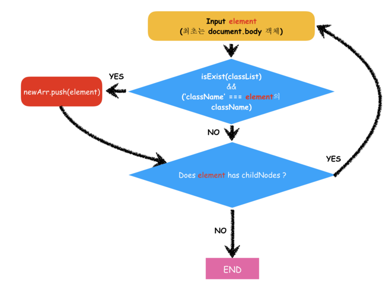

JSON.stringify() 함수 구현과 함께 받은 과제였는데, 재귀에 대한 이해가 너무 떨어져서 작성하는데 너무 오래걸렸다.. _(JSON.stringify() 함수 구현은_ [_여기_](https://medium.com/@lyhlg0201/stringifyjson-구현-ec3527a6cc5b)_를 참고)_

document.getElementsByClassName(_className_) 함수의 대한 설명은 [mdn문서](https://developer.mozilla.org/ko/docs/Web/API/Document/getElementsByClassName)를 참고 했다.

함수를 수행하면 html 파일 안에서 _className_에 해당하는 class를 가진 모든 element를 뽑아 오는 결과를 얻을 수 있다.

element 안에 element 즉 부모 자식 그리고 그 자식의 자식 …. 계속적인 level에 해당하는 검사를 수행 하기 위하여 재귀를 이용하였다.

#### 알고리즘은 아래와 같다.

1.  선택된 element가 classList를 가지고 있으며 그 class이름이 _className_에 속하면 새로운 배열에 집어(push) 넣는다.
2.  위의 세가지 조건을 검사하고 검사한 element가 자식 Node를 가지고 있는지 확인한다.
3.  자식 노드를 가지고 있으면 그 자식 노드를 재귀함수에 돌려 처음에 검사한 세가지 조건을 다시 검사하는 방식이다.
4.  내방식을 간단하게 Flow Chart로 만들어 봤다.

알고리즘 Flow Chart

#### **동작 방식**

1.  위 그림상으로는 Element를 input값으로 받게 되는데 최초에는 “document.body” element 를 input 값으로 받게됨.
2.  body 태그에 class가 있는지 검사하고 없으면 body태그가 자식노드를 갖고 있는지 확인
3.  만약 자식 노드가 있다면 (flowchart에는 없지만) 자식노드의 length만큼 재귀함수를 돌려 자식노드중 className을 포함하는 element를 찾는다.
4.  element의 classList가 존재하고 className이 element의 classname과 매칭될경우 새로운 배열에 해당 element를 push 한다.
5.  부모의 자식이 없을때까지 위 과정을 반복한다.

#### 소스코드

var getElementsByClassName = function(className){  
  var cache = \[\];  
  function getClassName(el){  
      if ( el.classList && el.classList.contains(className))  
        cache.push(el);  
      if( el.hasChildNodes() ){  
        for ( var i = 0 ; i < el.childNodes.length ; i ++)  
          getClassName(el.childNodes\[i\]);  
      }  
  }  
  getClassName(document.body);  
  return cache;  
};